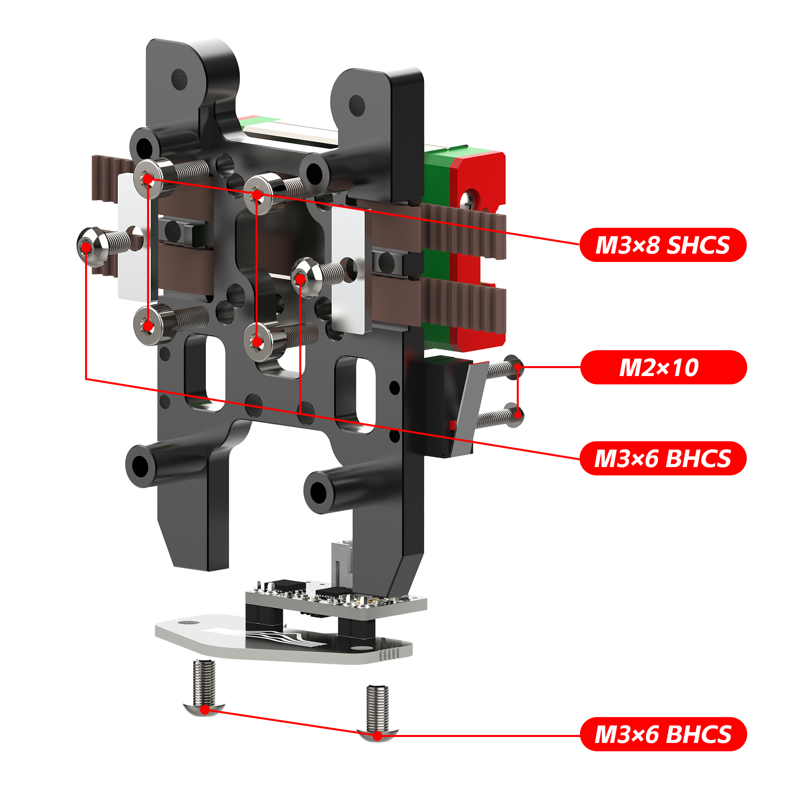
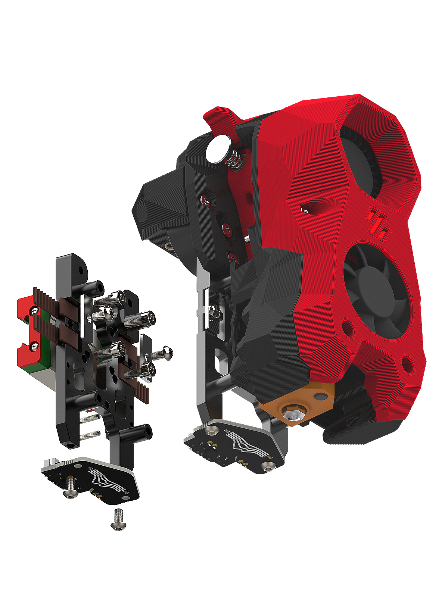
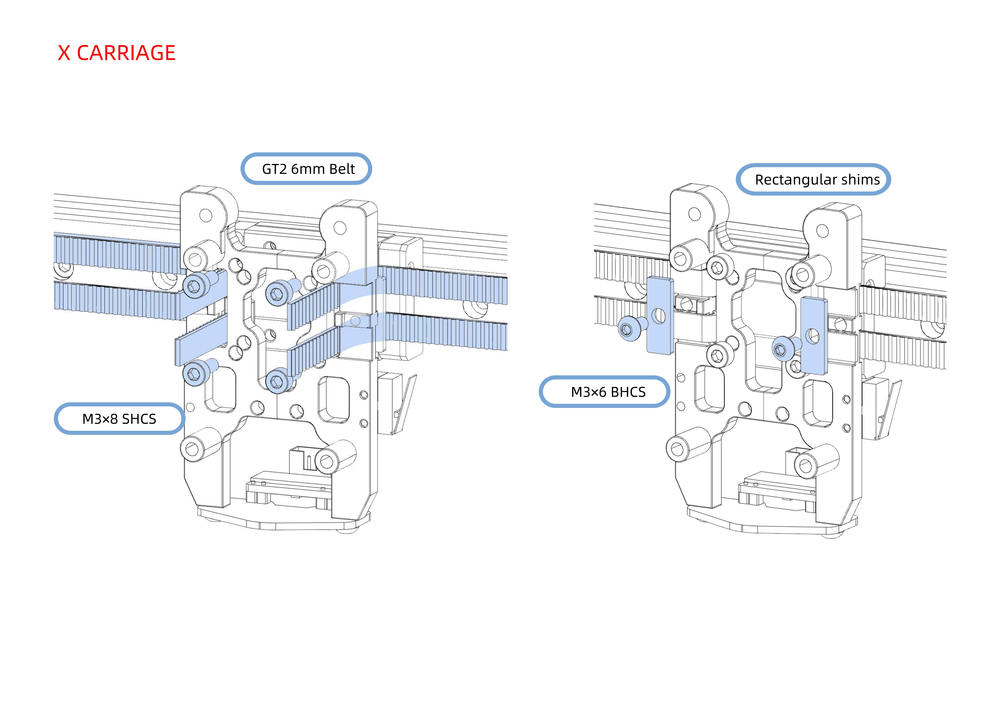

# 🚧 Installation


Note - since launch there have been a few different variations of the CNC mount, Original versions required M3\*8 BHCS to connect to the rail.&#x20;


<figure><figcaption></figcaption></figure>

<figure><figcaption></figcaption></figure>

### Installation Guide

<figure><figcaption></figcaption></figure>

<figure><figcaption></figcaption></figure>

### Things to note

1. If you are using a UHF Hotend or any NON-STANDARD StealthBurner parts, you MAY have to use extenders on the probe to lower it down to the correct height (\~3mm above the bed).&#x20;
