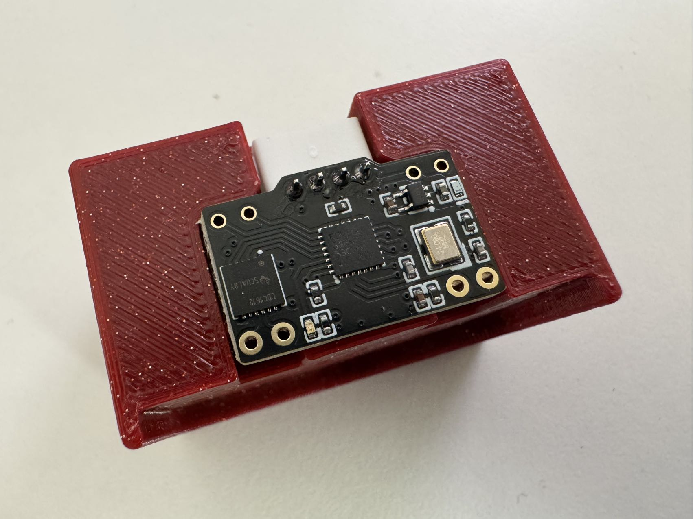
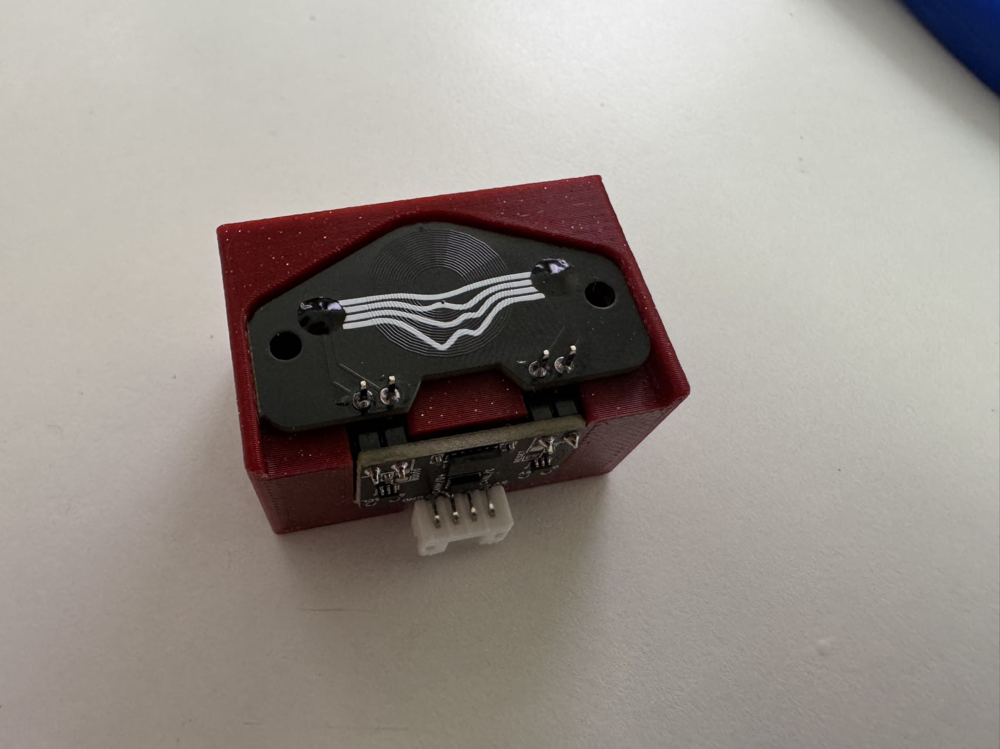
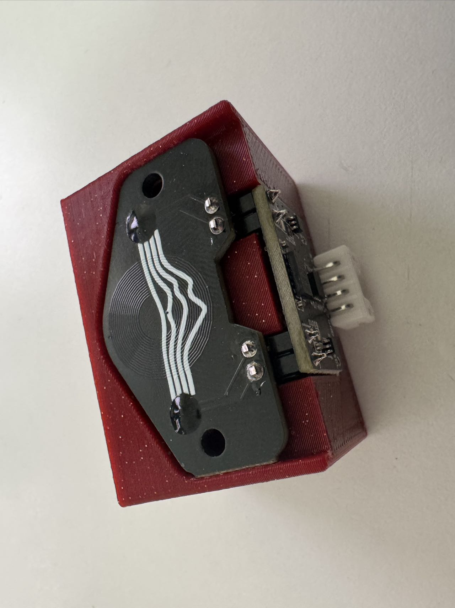

# Right Angle

In order to assemble your Cartographer, you will need the following tools.&#x20;

* Soldering Iron - I personally use the [Pinecil v2](https://pine64.com/product/pinecil-smart-mini-portable-soldering-iron/), would highly recommend.
* Snippers&#x20;
* Solder & Flux
* Flat Pack Cartographer coil board and MCU.&#x20;
* Cartographer Fastener Pack - from this you will need the 2 \* 2.54mm Bent Pins and the JST-PH angled connector.&#x20;


NOTE - If purchased as a Flat Pack, the USB / CAN Cable connector will need re-pinning for right angle assembly.&#x20;


### Step 1  - Print Assembly Jig

Print of our Standard Assembly Jig - it is avilable [here](https://github.com/Cartographer3D/cartographer-klipper/blob/master/assembly%20jig/Right%20Angle%20-%20Assembly%20Jig.stl)

There are no special printing instructions, though I would advise printing on a 0.4mm nozzle.&#x20;

<figure><figcaption>
Assembly Jig created by <a data-mention href="https://app.gitbook.com/u/5a099398f9717400307e6b92">MakerMylo</a>
</figcaption></figure>

### Step 2 - Place the JST right angle connector&#x20;

Place the JST right angle connector pointing up.

<figure><figcaption></figcaption></figure>

### Step 3 - Place the MCU Board

Place the MCU board into the JST connector.

<figure><figcaption></figcaption></figure>


BEFORE APPLYING ANY SOLDER - Ensure the MCU board has the correct orientation. The STM chip should be facing up.



Now apply solder to the JST pins, carefully ensuring you do not add solder to any of the surrounding components.&#x20;

<figure><figcaption></figcaption></figure>

### Step 3 - Coilboard

Remove the MCU board for now

Rotate the Jig with the coilboard section facing up adding the JST Right Angle connectors in, with the plastic part resting at the bottom, and the longer ends protruding up towards the coil

<figure><figcaption></figcaption></figure>

Add the coilboard in, you can secure in place using M3 screws if you wish, but it isn't neccessary.&#x20;

<figure><figcaption></figcaption></figure>

Rotate the Jig back towards yourself so the MCU board will be at the top.

### Step 4 - Solder the MCU board in place

Solder the MCU board into place, noting the rotation of the board. At this point you should be able to see the silk screen saying ADXL or CANL/D-. \
\
The JST connector should be protruding up, and not in it's assembly "well".

<figure><figcaption></figcaption></figure>

Once soldered, rotate the jig back down again so the coilboard is facing up.

### Step 5 - Soldering the Coilboard

Apply solder to the coilboard pins, ensuring that the rotation of the coilboard has the bumps facing up. The coilboard cannot be freely rotated, these epoxy bumps MUST be in the correct orientation.&#x20;

<figure><figcaption></figcaption></figure>

### Step 6 - Finish Up

Snip off the excess pins protruding out of the coilboard. Ensure you leave a small amount (1mm\~) and that you don't damage the coilboard or the traces.

<figure><figcaption></figcaption></figure>

### Step 7 - Finished

Gently pull your Cartographer out of the jig, and inspect for any issues. It should look like the example below.&#x20;

<figure><figcaption></figcaption></figure>
