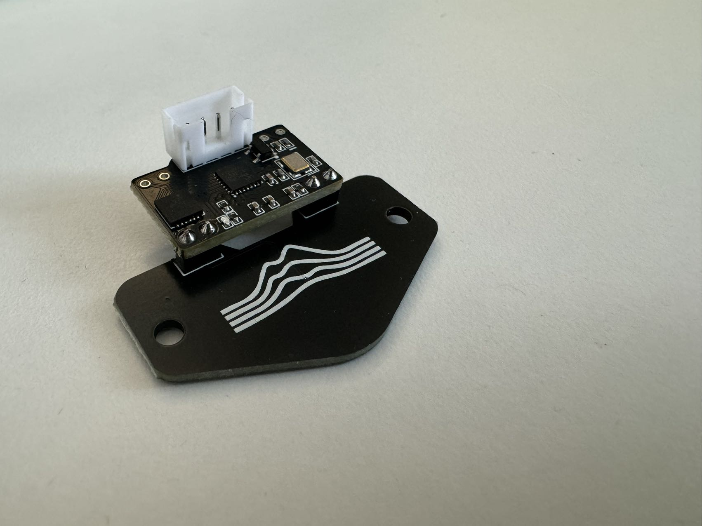

# Standard

In order to assemble your Cartographer, you will need the following tools.&#x20;

* Soldering Iron - I personally use the [Pinecil v2](https://pine64.com/product/pinecil-smart-mini-portable-soldering-iron/), would highly recommend.
* Snippers&#x20;
* Solder & Flux
* Flat Pack Cartographer coil board and MCU.&#x20;
* Cartographer Fastener Pack - from this you will need the 2 \* 2.54mm Pins and the JST-PH straight connector.&#x20;

### Step 1  - Print Assembly Jig

Print of our Standard Assembly Jig - it is avilable [here ](https://github.com/Cartographer3D/cartographer-klipper/blob/master/assembly%20jig/Cartographer%20Standard%20-%20Assembly%20Jig.stl)

There are no special printing instructions, though I would advise printing on a 0.4mm nozzle.&#x20;

<figure><figcaption>
Standard Assembly Jig
</figcaption></figure>

### Step 2 - Coilboard and Pins

Install the Coilboard with the bumps facing down into the indents made for them, and place the pins into the PCB

<figure><figcaption></figcaption></figure>

### Step 3 - MCU Placement&#x20;

Place the MCU on the bridge, making sure it is flat fits tightly. The main components such as t he MCU, resistors, capacitors and LDO are facing up. \


At this point check your orientations match the photo below, the MCU and the Coilboard MUST have the correct polarity


<figure><figcaption></figcaption></figure>

### Step 4 - Solder Pins

Heat your soldering iron to a sufficient temperature for your solder and apply flux if neccessary.&#x20;

Solder the pins from 1 to 4.&#x20;

<figure><figcaption></figcaption></figure>

### Step 5 - Remove and Replace in Jig

Gently take your MCU and Coilboard out of the rig, placing the JST connector correctly into the socket and replace into the other half of the jig.&#x20;

Again, ensure that the boards are tightly in place and are flat.

<figure><figcaption></figcaption></figure>

### Step 6 - Solder Pins (again)

Now solder in any order, ensuring that you do not bridge any of the pins.&#x20;

<figure><figcaption></figcaption></figure>

### Step 7 - Check your work

Check your work, it should look somewhat like the picture shown below.&#x20;

<figure><figcaption></figcaption></figure>
