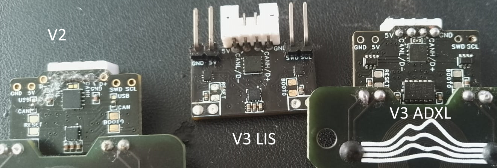
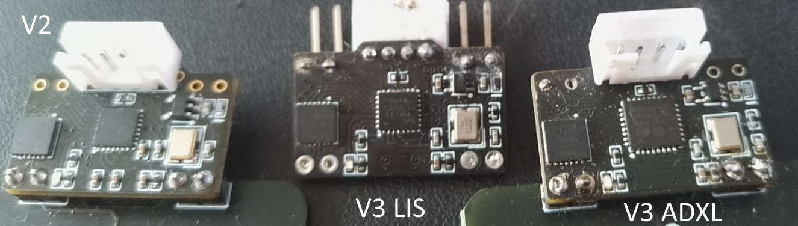

# ⁉️ FAQ

<mark style="color:purple;">Last Updated: December 17th 2024</mark>

### Why cant I use touch for bed mesh, homing etc

It is in development, however as of December, we are currently re-organizing the cartographer code to allow us more freedom to properly implement these features.

### Does Cartographer Touch use the ADXL sensor?

No, Survey Touch currently uses the [LDC1612](https://www.ti.com/product/LDC1612) sensor to calculate when the nozzle has come into contact with the bed.

### Can I use cartographer without touch without changing firmware?

Yes, you sure can. All you need to do is head into printer.cfg and under \[scanner] change `mode: touch` to mode`: scan`\
\
You will ofcourse need to create a new model by [following this guide.](archive/scan-based-calibration.md)

### Do I need to run the calibration while hot or cold?

It doesnt matter! Thats the point of touch! Do what works best for you.

### Does my nozzle need to be clean when doing a touch?

Yes it does, we recommend a silicone nozzle brush, <mark style="color:yellow;">which is now included with all cartographer purchases</mark>. However you can also adjust your retries, heat your nozzle to 150c in your print start and then do the touch. It should smoosh the filament off of the nozzle for you to get a successful touch. Nozzle brush is 100% better however.

### My bed mesh is scanning in Y direction and not X, how do i fix it?

In your `[scanner]` section add `mesh_main_direction: x` to your <mark style="color:yellow;">**printer.cfg**</mark>

### What do I need to add or change in my print start macro?

See [Print Start Macro](installation-and-setup/installation/print-start-macro.md). But bascially, you just need to make sure your nozzle is no hotter than <mark style="color:red;">**maximum 150c**</mark> and then do a `CARTOGRAPHER_TOUCH` after you do a `BED_MESH_CALIBRATE`

### Does touch work with glass or garolite beds?

It **CAN SOMETIMES** work depending on the thickness of your glass or garolite bed. However we can't say for certain. If its less than 2mm thick theres a good chance however we **accept no responsibility** if it **doesn't** work!&#x20;

### Is it guaranteed that this will work on my printer?&#x20;

As with a lot of things in life, we **can't guarantee 100% compatibility**, it should be compatible with most well built printers, there are obviously some exceptions, the biggest impacting factor is the quality of the Z axis motion. If there is any binding or lack of consistency, then you may find that you will not be able to use this feature. You can still use **regular cartographer scan mode** though!

### **Can Cartographer be used with RepRapFirmware in either USB or CAN mode?**&#x20;

RepRapFirmware (RRF) doesnt currently support multple MCUs, with the exception of via CAN-FD, which currently Cartographer does not support.&#x20;

### What temperature is Cartographer safe to?

The Coil is safe until 160c\
The MCU is rated to 85c however we've seen successful use until 100c. We recommend trying to keep it around 85c or lower.

### What does it mean when my coil is showing negative temperatures?

You've more than likely damaged your coil by knocking off one of the resistors. This wont affect functionality while using TOUCH. Contact us on discord to discuss.

### Do I still need to do the paper test?

When doing the manual steps of calibration yes, this shouldn't be often as you can re-calibrate faster if using touch. You should only paper test method if you've drastically changed something and you have no model to work from.&#x20;

### Cartographer has been working for weeks, suddenly it isn't, whats wrong?

This can be for a variety of reasons. Heres a short list of possible things to check:

* [ ] Is your toolhead completely rigid?
* [ ] Checked toolhead for loose screws?
* [ ] Checked toolhead for bad wiring?
* [ ] Checked A/B or  X/Y and Z belt tension?
* [ ] Checked lead screws?
* [ ] Is your nozzle clean?

If those things are checked, redo your calibration from the very start and if still having issues, [consult us on Discord by making a help thread.](https://discord.com/channels/1165274913624572014/1229798364514750596)

### Does Cartographer work with embedded magnet beds?

No, the embedded magnets will cause issues with your mesh. Magnetic sheets are perfectly fine as they cover the entire surface evenly.

### **Does Cartographer support Delta Printers**

Currently Cartographer does not support Delta printers, support will be added in future revisions of our firmware and code.&#x20;

### **Klipper is telling me it's dirty... should I re-install?**&#x20;

Dirty means that your Klipper directory is not clean i.e. has had changes to it compared to what is on the Github, this isn't something to worry about, it is expected with how Klipper currently deals with plugins.&#x20;

### **How do i know what model cartographer I have?**

<figure><figcaption>
Bottom of Cartographer
</figcaption></figure>

<figure><figcaption>
Top of Cartographer
</figcaption></figure>
