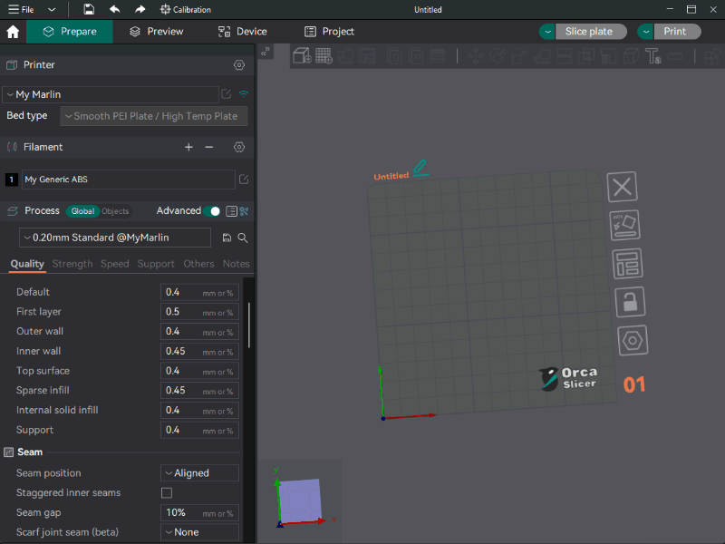

# Extras

<details>

<summary>Adjust Z Offset based on Bed Type (OrcaSlicer)</summary>




In your Machine start G-Code modify your PRINT\_START macro to be similar to this based on your personal needs. The main one to worry about <mark style="color:green;">ADDING</mark> is `BED_TYPE="[curr_bed_type]"`

```gcode
START_PRINT EXTRUDER_TEMP=[nozzle_temperature_initial_layer] BED_TEMP=[bed_temperature_initial_layer_single] CHAMBER_TEMP=[chamber_temperature] FILAMENT_TYPE=[filament_type] BED_TYPE="[curr_bed_type]"
```

This will pass which bed type your using to use in the modified PRINT\_START macro below

<mark style="color:red;">THE FOLLOWING GOES LAST IN YOUR PRINT\_START MACRO</mark>

```gcode


  SET_GCODE_ADJUST Z_ADJUST=0.00


  SET_GCODE_ADJUST Z_ADJUST=0.00


  SET_GCODE_ADJUST Z_ADJUST=0.00


  SET_GCODE_ADJUST Z_ADJUST=0.00


```

</details>

<details>

<summary>Adjusting Z Offset via Slicer</summary>

Finding you need additional or less z-offset on a per filament basis? Go into your slicer and find the Filament settings page. You will be able to add the custom g-code below that will run after your PRINT\_START macro giving this option!

```gcode
SET_GCODE_OFFSET Z_ADJUST=0.01
```

You could also set up duplicate filament settings and use them for different bed types to send a different offset depending on which bed your using and use that filament profile to slice!

### SuperSlicer - Per Filament


### OrcaSlicer - Per Filament


### What does it do?

It will add an modify the z-offset based on your filaments custom z-offset gcode, giving you either MORE or LESS squish based on filament settings.


</details>
