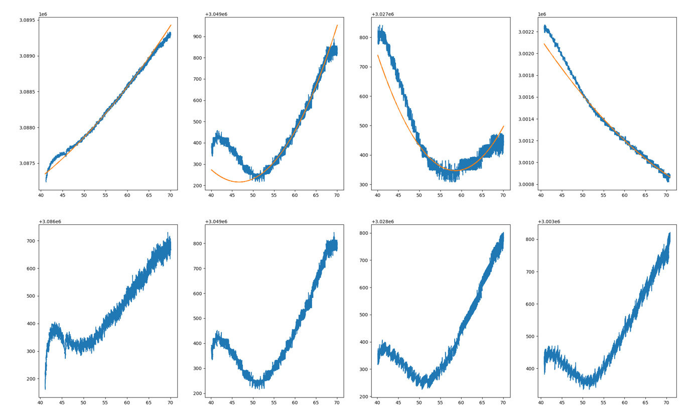

---
layout:
  title:
    visible: true
  description:
    visible: true
  tableOfContents:
    visible: true
  outline:
    visible: true
  pagination:
    visible: false
---

# Temperature Differential Calibration



[Note - This is not needed if you are using Cartographer Survey Touch! ](#user-content-fn-1)[^1]



This requires Cartographer v1.0.0-17-g944c62e9 or later.&#x20;



After doing any form of Temperature Calirbation, it is essential you re-complete the `CARTOGRAPHER_CALIBRATION` on EVERY model.\
\
IF YOU DO NOT DO THIS, YOU MIGHT DO DAMAGE TO YOUR PRINT SURFACE.


This tutorial aims to optimize the temperature compensation parameters and reduce the temperature drift, which takes a long time (sometimes more than 3 hours) to carry out this optimization.

### Update your printer config file in Klipper.

Modify your printer.cfg, adding the following macro. This should be added to the bottom of your printer.cfg file.&#x20;


This Macro will take your bed up to 110oC, if your printers bed is not capable of that temperature, please lower the M140 commands to a safe temperature for you. \
\
M140 S110 = 110oC\
M140 S95 = 95oC&#x20;


```gcode
[gcode_macro DATA_SAMPLE]
gcode:
  

  
  
  

  G90
  M106 S255
  RESPOND TYPE=command MSG='Waiting for Coil to cool to 40'
  M117 Waiting for Coil to cool to 40
  TEMPERATURE_WAIT SENSOR='temperature_sensor cartographer_coil' MAXIMUM={min_temp}
  RESPOND TYPE=command MSG='Starting Phase 1 of 4'
  M117 Starting Phase 1 of 4
  M106 S0
  G28
  G0 Z1
  M104 S{nozzle_temp}
  M140 S{bed_temp}
  G4 P1000
  TEMPERATURE_WAIT SENSOR='temperature_sensor cartographer_coil' MINIMUM={min_temp}
  CARTOGRAPHER_STREAM FILENAME=data1
  M117 Waiting for Coil to heat to 70
  RESPOND TYPE=command MSG='Waiting for Coil to heat to 70'
  TEMPERATURE_WAIT SENSOR='temperature_sensor cartographer_coil' MINIMUM={max_temp}
  CARTOGRAPHER_STREAM FILENAME=data1
  M104 S0
  M140 S0
  M106 S255
  G0 Z80
  RESPOND TYPE=command MSG='Waiting for Coil to cool to 40'
  M117 Waiting for Coil to cool to 40
  TEMPERATURE_WAIT SENSOR='temperature_sensor cartographer_coil' MAXIMUM={min_temp}
  M117 Starting Phase 2 of 4
  RESPOND TYPE=command MSG='Starting Phase 2 of 4'
  M106 S0
  G28 Z0
  G0 Z2
  M104 S{nozzle_temp}
  M140 S{bed_temp}
  G4 P1000
  CARTOGRAPHER_STREAM FILENAME=data2
  M117 Waiting for Coil to heat to 70
  RESPOND TYPE=command MSG='Waiting for Coil to heat to 70'
  TEMPERATURE_WAIT SENSOR='temperature_sensor cartographer_coil' MINIMUM={max_temp}
  CARTOGRAPHER_STREAM FILENAME=data2
  M104 S0
  M140 S0
  M106 S255
  G0 Z80
  RESPOND TYPE=command MSG='Waiting for Coil to cool to 40'
  M117 Waiting for Coil to cool to 40
  TEMPERATURE_WAIT SENSOR='temperature_sensor cartographer_coil' MAXIMUM={min_temp}
  M117 "Starting Phase 3 of 4"
  RESPOND TYPE=command MSG='Starting Phase 3 of 4'
  M106 S0
  G28 Z0
  G0 Z3
  M104 S{nozzle_temp}
  M140 S{bed_temp}
  G4 P1000
  CARTOGRAPHER_STREAM FILENAME=data3
  M117 Waiting for Coil to heat to 70
  RESPOND TYPE=command MSG='Waiting for Coil to heat to 70'
  TEMPERATURE_WAIT SENSOR='temperature_sensor cartographer_coil' MINIMUM={max_temp}
  CARTOGRAPHER_STREAM FILENAME=data3
  M104 S0
  M140 S0
  RESPOND TYPE=command MSG='Testing complete, please move files using: mv ~/klipper/data1 ~/klipper/data2 ~/klipper/data3 ~/cartographer-klipper/'
  M117 "Testing complete, please move files using: mv ~/klipper/data1 ~/klipper/data2 ~/klipper/data3 ~/cartographer-klipper/"
  RESPOND TYPE=command MSG='Follow the remaining instructions here: https://docs.cartographer3d.com/cartographer-probe/advanced-features/temperature-differential-calibration-beta'
  M117 "Follow the remaining instructions here: https://docs.cartographer3d.com/cartographer-probe/advanced-features/temperature-differential-calibration-beta"
```

The macro is then executed, and then the data1, data2, and data3 files are generated in the Klipper folder, note, this can take a very long time.

Once complete, move the files (data1, data2, data3) to your cartographer-klipper folder.&#x20;

```bash
mv ~/klipper/data1 ~/klipper/data2 ~/klipper/data3 ~/cartographer-klipper/
```

You will need to ensure your host OS has the libraries and dependancies in it.

```bash
~/klippy-env/bin/pip install pandas
~/klippy-env/bin/pip install matplotlib
sudo apt-get install libopenblas-dev
~/klippy-env/bin/pip install -v numpy
~/klippy-env/bin/pip install scipy
```

Once installed, run the following script, this will analyse the data from the files that you have moved. You need to ensure that you are on the latest version of our firmware, if you get an error about file not existing, go to our Klipper Setup page and re-run that initial script.&#x20;

```bash
cd ~/cartographer-klipper
~/klippy-env/bin/python tempcalib.py
```

After running, four parameters will be generated and a picture will be generated in your bash window and a image in your `cartographer-klipper` folder.&#x20;

(This process is very computationally intensive and takes a while, if the files are too big it may fail) Please check the picture named fit\_output.png and judge the fitting effect. The picture example is as follows:

<figure><figcaption><p>Example 1</p></figcaption></figure>

<figure><figcaption><p>Example 2</p></figcaption></figure>

Once complete, it will generate an image called fit.png as well as show some values in your terminal window.

```
tc_a_a:5.367848131964879e-06
tc_a_b:1.7559290784042338
tc_b_a:0.0007546669217813525
tc_b_b:-343.290029518937
```

Copy the results at the end of the `[cartographer]` section of your config,

**Example below**

```yaml
[cartographer]
serial:
    canbus_uuid: 39df93ji34
speed: 40.
#   Z probing dive speed.
lift_speed: 5.
#   Z probing lift speed.

#   REST OF THE CONFIG REMOVED TO MAKE THIS LESS CLUNKY.

#   End of config section. 
tc_a_a:5.367848131964879e-06
tc_a_b:1.7559290784042338
tc_b_a:0.0007546669217813525
tc_b_b:-343.290029518937
```

Once added, save and restart your config.&#x20;

You will now have to re-calibrate your probe, to do this

```
CARTOGRAPHER_CALIBRATE    
```

Once compelete, SAVE & RESTART your config.&#x20;


After doing any form of Temperature Calirbation, it is essential you re-complete the `CARTOGRAPHER_CALIBRATION` on EVERY model.\
\
IF YOU DO NOT DO THIS, YOU MIGHT DO DAMAGE TO YOUR PRINT SURFACE.


[^1]: 
