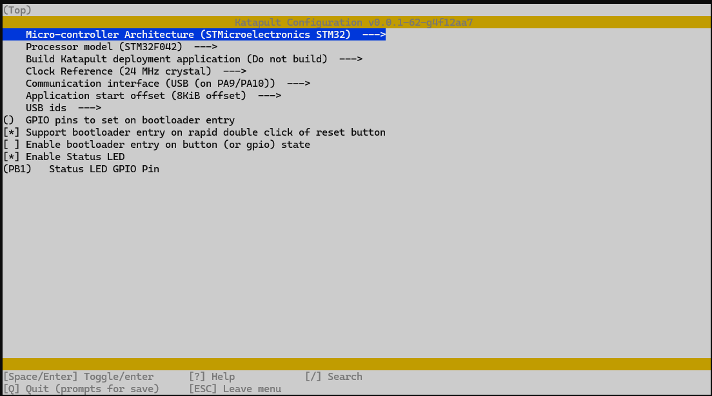
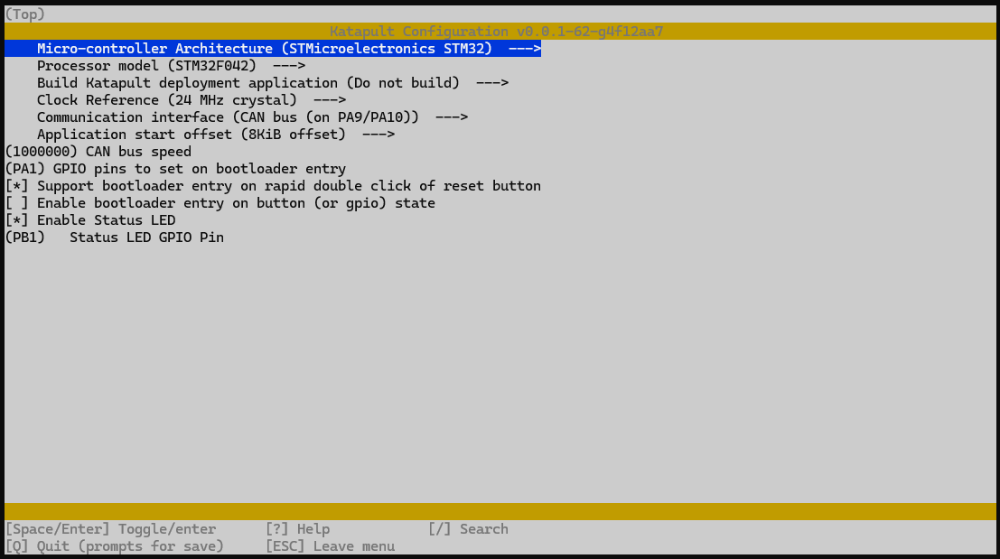

# Katapult

You may want to build your own version of Katapult, currently Katapult doesn't support the stm32f042 at 24mhz.

Download our build of Katapult below.&#x20;



### Cartographer v2 and v3 (stm32f042 based probes).&#x20;

#### USB

The USB version requires the following settings.&#x20;

<figure><figcaption>
Katapult settings for USB Cartographer
</figcaption></figure>

#### CAN

The CAN version requires the following settings.&#x20;

<figure><figcaption>
Katapult settings for CAN Cartographer
</figcaption></figure>
