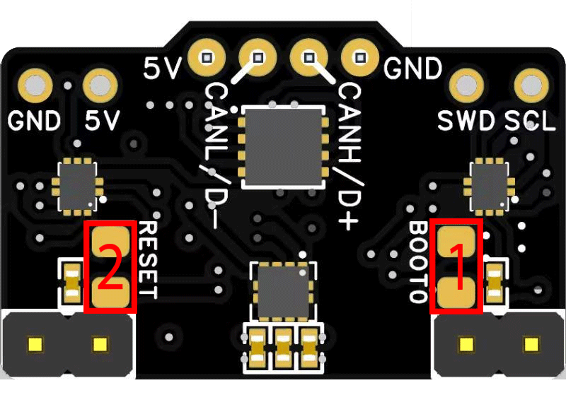

# Re-Flashing Firmware

A number of probes unfortunatly shipped miss-flashed with the incorrect firmware, this guide will go through how to re-flash them with the correct firmware.

### Equipment / Parts Required

For this, you will need the following items / tools, though it does vary depending on the configuration you recieved, or if you have any existing equipment.&#x20;

If you recieved a USB Cable with your order, OR have a USB Cable terminated with a JST-PH connector then continue from **here**

If you happen to have a ST-Link Flasher ([like this](https://www.amazon.com/Sumklin-ST-Link-Emulator-Downloader-Connect/dp/B0CHWKJQYB/ref=sr\_1\_6?crid=S6B8HWUSRC0Z\&dib=eyJ2IjoiMSJ9.qqFD5Om07FWVxJ7mURnZvPq709MTcuqoA3fE0gXiF\_SWEFG9f1NUd634THxfckI76D\_hZ3arbsDiW-Db1xTIEOza\_to4Idw50g0wqw8NlTEQcTI\_alwxI6Vlp09baxGXlMWWQvW8BoursvDtdmAKY7ExUxOwyWdp-R7b-9ekncnwAIKpE0SS1KY7FmNICg4GXiJzwnURM0ze\_dw8vLbUXr2P1rsvtNRHpObpiPAhdS4.usA91wnACoc6mryl4h5GOt6De85Z-hRVX8W9dbaCDLc\&dib\_tag=se\&keywords=ST+Link\&qid=1710043006\&sprefix=st+l%2Caps%2C874\&sr=8-6)), the process is a bit simpler, to find out more information click [here](cartographer-with-input-shaper/update-via-stlink.md)

There are two solutions;

* Method 1 - Modifying a USB cable to connect with the CAN cable&#x20;
* Method 2 - Create a USB Cable with a JST-PH Connector&#x20;

**Method 1  Equipment**

* A old USB cable, any old USB2 cable which does data (not a charge only USB-C Cable)&#x20;
* Your fastener pack that came with your probe
* Your CAN cable
* Some cutters / strippers.&#x20;
* 1 or 2 Tweezers (or something to bridge the BT0 and RESET pad)

Method 2 Equipment

* A old USB cable, any old USB2 cable which does data (not a charge only USB-C Cable)&#x20;
* Your fastener pack that came with your probe
* Some cutters / strippers.&#x20;
* A crimp tool for JST-PH
* 1 or 2 Tweezers (or something to bridge the BT0 and RESET pad)

### Method 1

Step 1 - Cut the end off your donor USB cable

<figure><figcaption><p>Remove the end of the USB Cable</p></figcaption></figure>

Step 2 - Remove the outer plastic, revealing the 4 pairs of cables

<figure><figcaption><p>Remove the outer plastic</p></figcaption></figure>

Remove any outer sheilding

<figure><figcaption></figcaption></figure>

Use your snippers / strippers to expose about 6 - 8 mm at the end of your wires

<figure><figcaption></figcaption></figure>

Step 3 - Feed the exposed wires into the DuPont connectors, and use the right angle DuPont male connectors to plug the cable in and force contact

<figure><figcaption></figcaption></figure>

<figure><figcaption><p>Notice the DuPont 2.54mm RA connectors plugging the cable in.</p></figcaption></figure>


Typically the following cables will be matched with each other&#x20;

| USB Cable   | CAN Cable      |
| ----------- | -------------- |
| Red - 5v    | Red - 5v       |
| Black - GND | Black - GND    |
| Green (D+)  | Yellow (Can H) |
| White (D-)  | White (Can L)  |

You should be able to connect your USB Cable to your computer now, as the probe will have accidently been flashed with USB Firmware rather than CAN, so if you plug into a Windows PC, you should hear that new device connected chime.&#x20;

If you plug it into your Pi, or a linux PC it shouild appear under `lsusb` as OpenMoko, and if you recieved your probe in mid-march, and it has the USB firmware on it, if you do:

`ls /dev/serial/by-id/`

It should appear as a serial device there. Any issues, please join our Discord and ping me (RichardTHF) for help and support.&#x20;

### Method 2

Crimping your own JST-PH - USB cable, this is a useful cable to have, and can be done with the crimps and connector incldued with the probe.&#x20;

#### Step 1

Cut the end off your donor USB cable. This needs to be a cable which works for data, there seem to be a lot of USB cables which are power only, these will not work.&#x20;

<figure><figcaption></figcaption></figure>

#### Step 2&#x20;

Strip the cable back to reveal the internal cables.&#x20;

<figure><figcaption></figcaption></figure>

#### Step 3&#x20;

Crimp the JST PH connectors onto the cable.&#x20;

I found this video for how to crimp JST connectors, check it out its very well done.&#x20;



<figure><figcaption></figcaption></figure>

Step 4 - Rehouse the connector

Notice the order - of the cable and connector.&#x20;

<figure><figcaption><p>Notice the order of the cables.</p></figcaption></figure>

You should be able to connect your USB Cable to your computer now, as the probe will have accidently been flashed with USB Firmware rather than CAN, so if you plug into a Windows PC, you should hear that new device connected chime.&#x20;

If you plug it into your Pi, or a linux PC it shouild appear under `lsusb` as OpenMoko, and if you recieved your probe in mid-march, and it has the USB firmware on it, if you do:

`ls /dev/serial/by-id/`

It should appear as a serial device there. Any issues, please join our Discord and ping me (RichardTHF) for help and support. &#x20;

The following method is compatible with MOST Cartographer probes, please check the compatibility chart listed below.&#x20;


### Firmware

The best place to get the probes firmware is from our  [GitHub](https://github.com/Cartographer3D/cartographer-klipper/tree/master/firmware). These have been tested thoroughly, and are known to work perfectly.  If you want to find a link to the latest firmware for each of your probes, please check [here](https://docs.cartographer3d.com/firmware-update/which-firmware).

You can also build your own firmware, our GitHub organisation has both a custom build of [Klipper](../../) and [Katapult](https://github.com/Cartographer3D/katapult) that you can build yourself.&#x20;


Untested Firmware could brick your probe - it is advisable if this is the case, you have a STLink handy in order to easily re-flash the probe.


### Entering DFU Mode

To enter DFU Mode, it can be a bit fiddly, but once you get the knack of it, it's fairly simple.&#x20;

Plug your USB cable into the device you will be flashing from and your Cartographer probe, this can be either a seprate Windows PC, Mac, or a Linux machine, or the device you run your 3D Printer off. &#x20;

Using your ferrous tweezers, or similar use one to bridge pads 1 (boot0), once you have a solid contact on those tap pad 2 (reset) with your other ferrous tool.&#x20;

<figure><figcaption></figcaption></figure>



If you have done this correctly, your device should have entered DFU Mode.&#x20;

To check,&#x20;

* Linux - follow the following steps
  * SSH in, or load a termanal shell.&#x20;
  * type `lsusb` in your bash shell, it should list a device in DFU Mode
  * One of the options should be `Bus 001 Device 004: ID 0483:df11 STMicroelectronics STM Device in DFU Mode` - This (as long as you don't have any other devices in DFU Mode) should be your Cartographer Probe in DFU Mode.
* Windows - follow the following steps
  * Start Menu
  * Search and open "Device Manager"
  * Scroll down to Universal Serial Bus Devices&#x20;
  * You should see STM32 BOOTLOADER as an option\
    &#x20;
* Mac - TBC

### Flashing via STM32CubeProgrammer (Windows & MacOS)



Download and Install STM32CubeProgrammer from [here](https://www.st.com/en/development-tools/stm32cubeprog.html), I warn you it requires you to sign up for an account.

Open the application, and on the RIGHT side, select the following options and press **Connect**.&#x20;

<figure><figcaption><p>STM32CubeProgrammer Settings</p></figcaption></figure>

Once you have connected, Click Open File - you will need to select both the Katapult Bootloader for your board, and your Cartographer Firmware that you have downloaded.&#x20;

<figure><figcaption><p>Firmwares Loaded</p></figcaption></figure>

For your Cartographer Firmware, you need to set the address to `0x08002000` This provides the 8KiB offset for the firmware. Katapult firmware can be flashed at the default `0x08000000.`

<figure><figcaption><p>How to change the address in STM32CubeProgrammer</p></figcaption></figure>

If in doubt about what address to use, please check the relevent tables [here](https://docs.cartographer3d.com/firmware-update)

On each of the firmware's press "Download", starting with Katapult, then with Cartographer. \
\
Now press Disconnect in the TOP RIGHT corner.&#x20;

If your BLUE LED is Flashing, you have not fully flashed your Firmware, and you should start again, If you now Power Cycle your probe, or simply hit the RESET (2) pads from earlier, your probe should react when it has anything solid metal put under it.&#x20;

### Flashing via DFU Util (Linux Terminal).&#x20;



SSH into your linux host MCU, ensuring that your Cartographer is plugged in and in DFU Mode.&#x20;

Navigate into the correct folder, so if you want to update your v3 run the following command.&#x20;

```
cd ~/cartographer-klipper/firmware/v3 - Carto with Input Shaper Hybrid
```

Once in the folder, simply check that your probe is still in DFU Mode by running `lsusb`, and if you still get a result stating it is in DFU Mode, run the following command.&#x20;

```
dfu-util -R -a 0 -s 0x08000000:leave -D firmware.bin
```

NOTE - REPLACE the address (`0x08000000`) with what ever is listed in the table here for the specific firmware you are using, and rename `firmware.bin` to what ever the firmware file you are using is called.&#x20;

Example:

```
dfu-util -R -a 0 -s 0x08000000:leave -D Full_Cartographer_USB_v3.bin
```

Once compelete, it should exit out of DFU mode, and you should be able to find your probe using either CAN or USB.&#x20;
