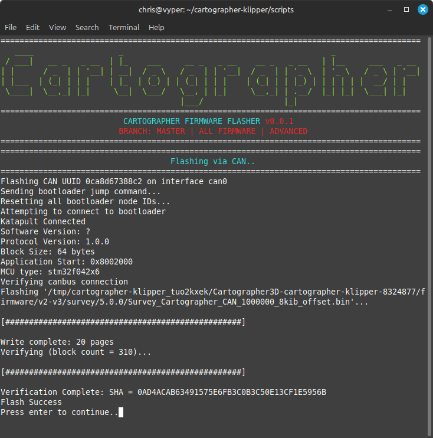
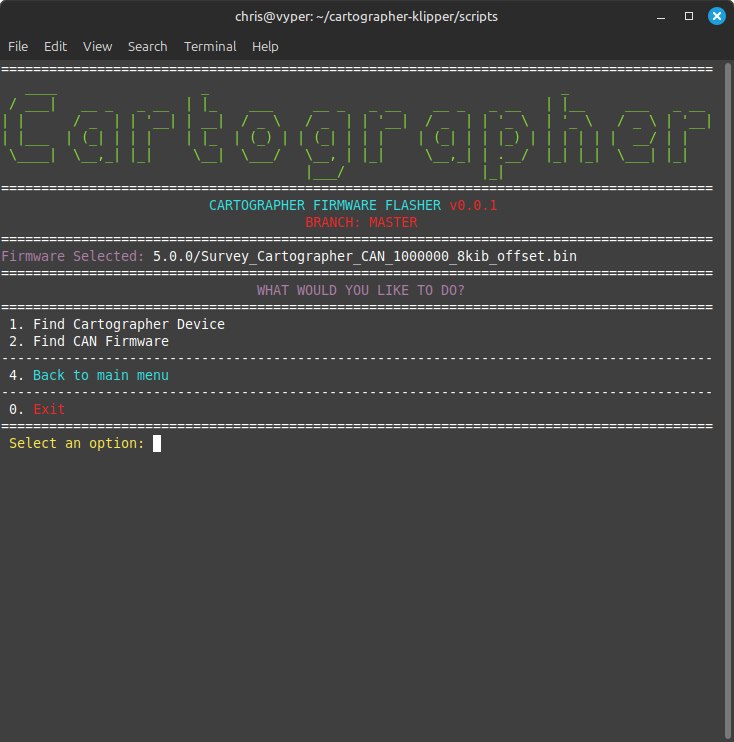

# CANBUS Bitrate Switching

## Do You Need To Switch Bitrate?

Are you running CANBUS at a different bitrate? If you arent using the default 1M (1000000) go ahead and use the steps below to swap to whatever version you need.

***

## Step 1. Plug In Cartographer via CANBUS

## Step 2. SSH Into Your Host Device & Run The Script

```bash
cd ~/cartographer-klipper/scripts
./firmware.py -f can -k
```

<figure><figcaption></figcaption></figure>

## Step 3. Find Your Device

<figure><figcaption></figcaption></figure>

## Step 4. Select Which Firmware/Bitrate You Want

<figure><figcaption></figcaption></figure>

## Step 5. Flash Firmware

<figure><figcaption></figcaption></figure>

## Step 6. Re-Run Script

```bash
cd ~/cartographer-klipper/scripts
./firmware.py -f can
```

<figure><figcaption></figcaption></figure>

## Step 7. Find Your Device

<figure><figcaption></figcaption></figure>

## Step 8. Select Firmware & Flash

<figure><figcaption></figcaption></figure>

<figure><figcaption></figcaption></figure>

<figure><figcaption></figcaption></figure>

## Step 9. Done
