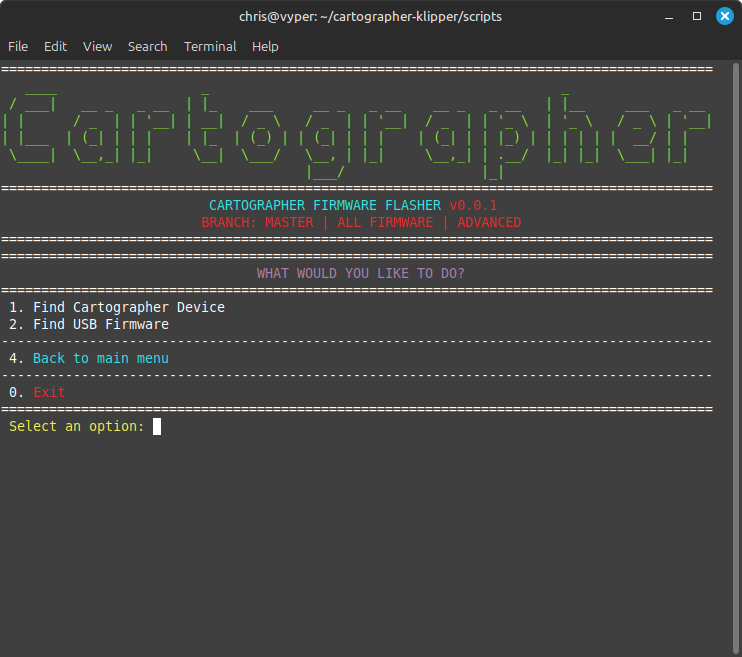
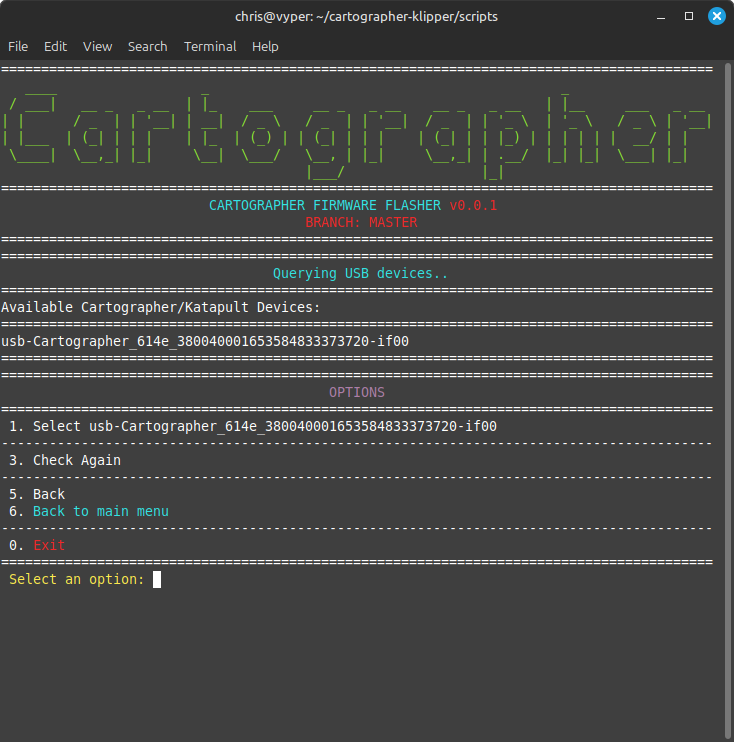

# CANBUS to USB

## Currently Using CANBUS?

Looking at using Cartographer via USB instead of CANBUS? Follow the steps below to make the change!

***

## Step 1. Plug In Cartographer via CANBUS

## Step 2. SSH Into Your Host Device & Run The Script

```bash
git clone https://github.com/Cartographer3D/cartographer_firmware.git
~/cartographer_firmware/scripts/firmware.py -f can -t
```

<figure><figcaption></figcaption></figure>

## Step 3. Find Your Device

<figure><figcaption></figcaption></figure>

## Step 4. Select The USB Firmware

<figure><figcaption></figcaption></figure>

<figure><figcaption></figcaption></figure>

## Step 5. Flash Katapult Firmware

<figure><figcaption></figcaption></figure>

## Step 6. Unplug CANBUS and plug into USB

## Step 7. Re-run Script

```bash
~/cartographer-klipper/scripts/firmware.py -f usb
```

<figure><figcaption></figcaption></figure>

## Step 8. Find Your Device

<figure><figcaption></figcaption></figure>

## Step 9.Select Firmware & Flash

<figure><figcaption></figcaption></figure>

<figure><figcaption></figcaption></figure>

<figure><figcaption></figcaption></figure>

## Step 10. Done
