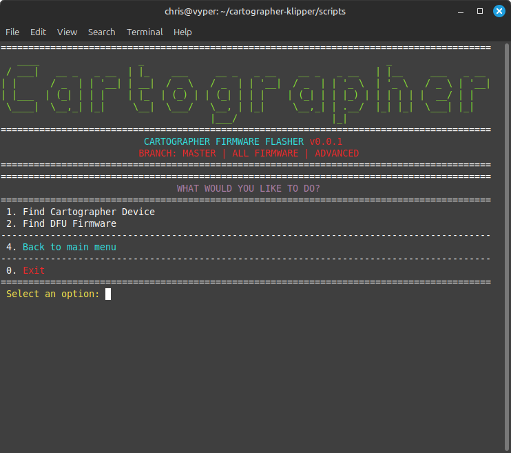
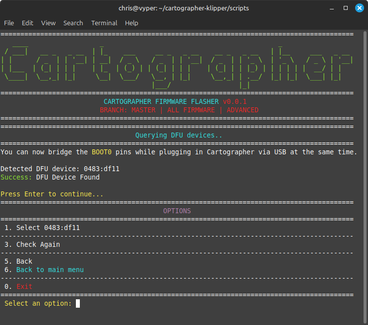
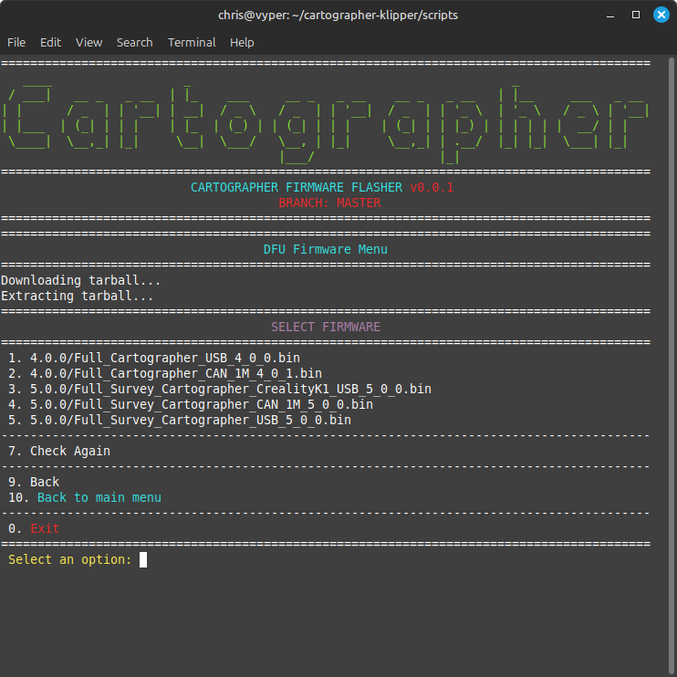
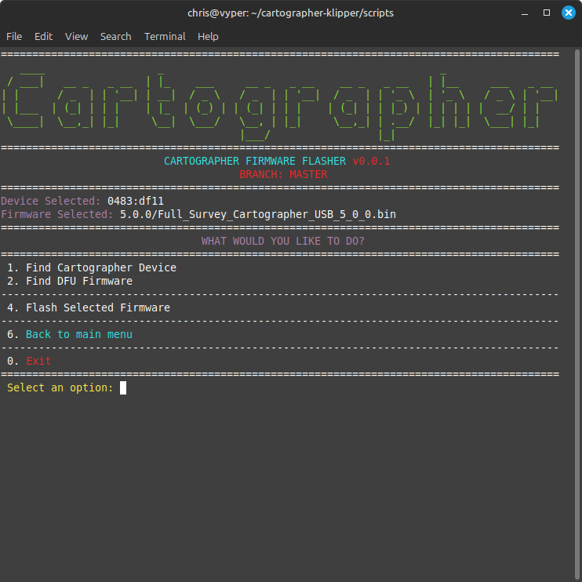
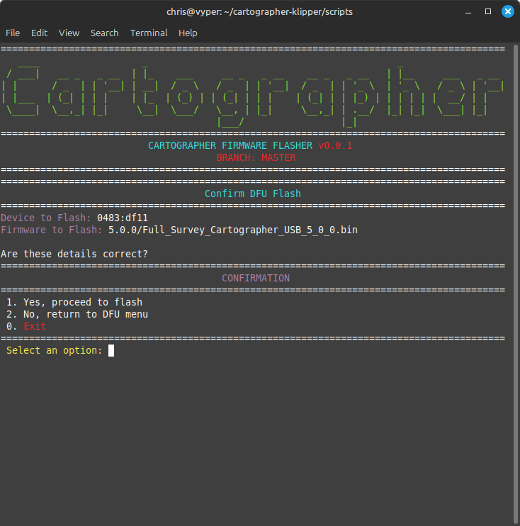
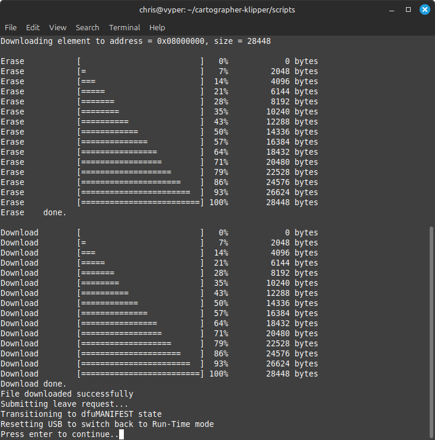
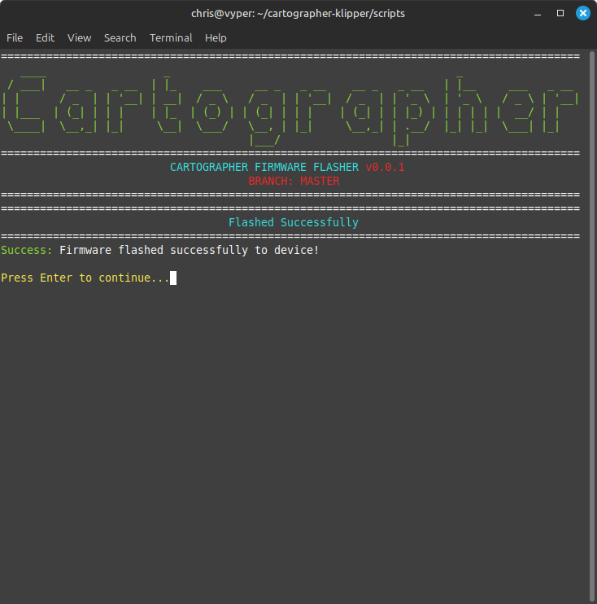

---
layout:
  title:
    visible: true
  description:
    visible: true
  tableOfContents:
    visible: true
  outline:
    visible: true
  pagination:
    visible: false
---

# via DFU

### Should You Be Using DFU?

* DFU mode should be used to flash if you dont have access to CAN in order to change from CAN to USB or if for some reason Katapult isnt available.

### Whats Required?

* Host device (RaspPi/Manta + CB1 etc)
* Cartographer Probe
* Two pairs of conductive (Metal) Tweezers
*   USB-A to JST-PH Cable

    <figure><figcaption></figcaption></figure>


Using the scripts below, you may need to use the **Install Prerequisites** option first to make sure everything is configured prior to flashing.


## DFU Updating

### What is DFU

* DFU Mode (Device Firmware Upgrade Mode) is STM's bootloader thats apart of the STM32 chip included on cartographer probes. Its next to impossible to make this mode fail. For the STM chip to enter DFU mode all that needs to happen is to have the boot pin pulled high when the chip itself starts up.

### Step 1. Enter DFU Mode



No LEDs will be on when in DFU mode. If the blue LED is lit, even intermittently, the device is in runtime mode and this isnt what we want. Continue touching those pads till it works!


* Entering DFU mode is simple in theory but a bit more fiddly in practice. With the cartographer plugged in via USB, first short the two pads of the **BOOT0** set (marked 1 on the photo). With **BOOT0** still shorted, briefly short the RESET pads (marked 2). This will put the device in DFU mode.
* You can also just short the **BOOT0** pads and <mark style="color:red;">NOT the RESET pads</mark>, whilst plugging in the device via USB which should be easier to enter DFU.
* This process can be tricky and take some time, so listed below are two ways to make it simpler.

#### Make-it-easier option #1: printed tweezer guide

* You can use the PCB cover designed by [MakerMylo](https://www.youtube.com/@makermylo) to help with the fine-motor work of shorting pads. It clips onto the PCB and helps you to align tweezers accurately for shorting pads.



#### Make-it-easier option #2: solder-bridging the **BOOT0** pads

* Soldering a bridge on the **BOOT0** pads can make this process much easier. You will still need to briefly short the **RESET** pads, but you won't have to coordinate two sets of tweezers.
* Once you've flashed by using DFU mode, remember to de-solder the bridge.

### Step 2. SSH into Host & Run Script


Via SSH, use the command `lsusb` to determine whether the device is in **DFU Mode**\
\
**OR**\
\
**This can now be entered and automated using the** [**script below**](https://docs.cartographer3d.com/cartographer-probe/firmware/firmware-updating/via-dfu#step-2.-ssh-into-host-and-run-script) **and using lsusb from option #2 which loops the lsusb command while you attempt to tap the pins.**


<figure><figcaption><p>lsusb should look like this if DFU mode is found.</p></figcaption></figure>

```bash
cd ~/cartographer-klipper/scripts
./firmware.py -f dfu
```





On the next screen it will attempt to find your DFU device. This will loop for 30 seconds while you put your device into DFU mode if it isn't already. \
\
You do this by either bridging the <mark style="color:yellow;">**boot0**</mark> pins and plugging in the USB or by plugging in via USB and then bridging both <mark style="color:yellow;">**boot0**</mark> and <mark style="color:yellow;">**reset**</mark> pins.


<figure><figcaption></figcaption></figure>

<figure><figcaption></figcaption></figure>


Choose FULL\_CARTOGRAPHER\_CANBUS for using Cartographer via CANBUS.

Choose FULL\_CARTOGRAPHER\_USB for using Cartographer via USB




<figure><figcaption></figcaption></figure>

### Step 3. Done

Once flashed, you will see the image below. This is a successful flash and youre all finished.

<figure><figcaption><p>Screen #4</p></figcaption></figure>

<figure><figcaption></figcaption></figure>

### Step 4. Now What?

* If you flashed for canbus, unplug cartographer and plug in via canbus
* If you flashed for usb, power cycle your device.
