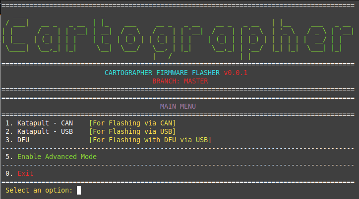
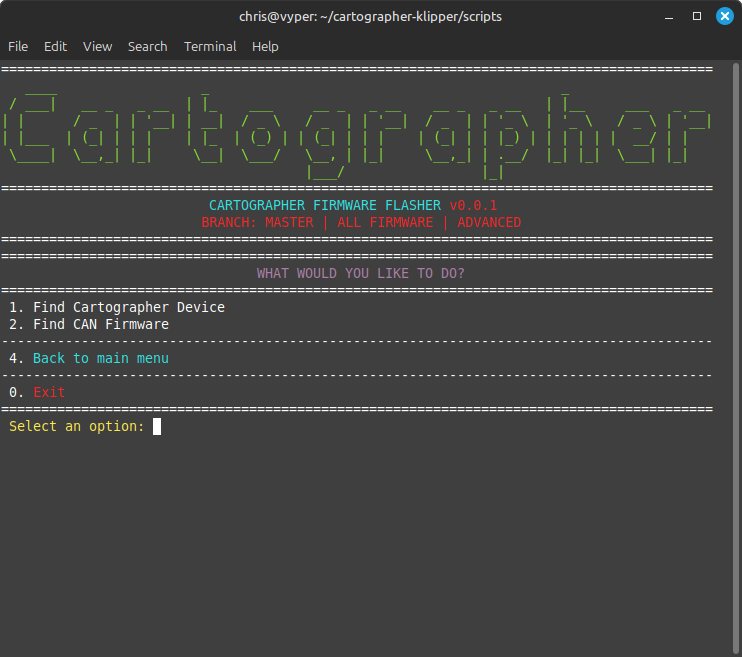
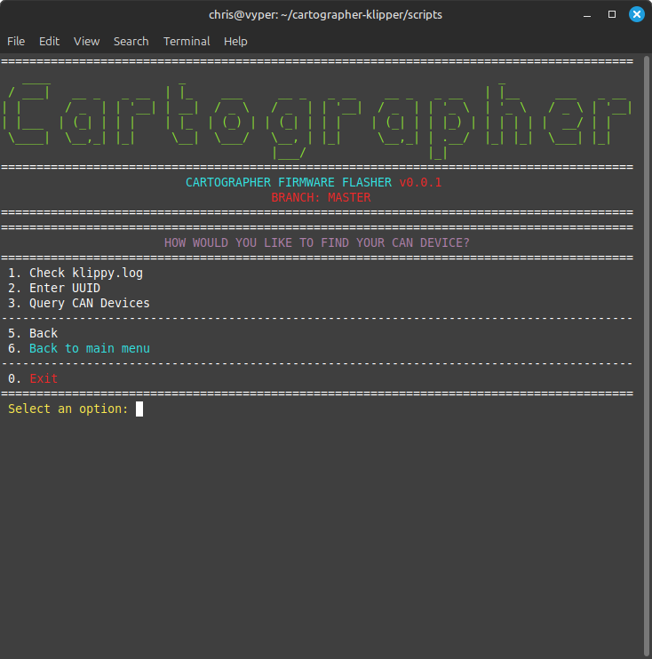
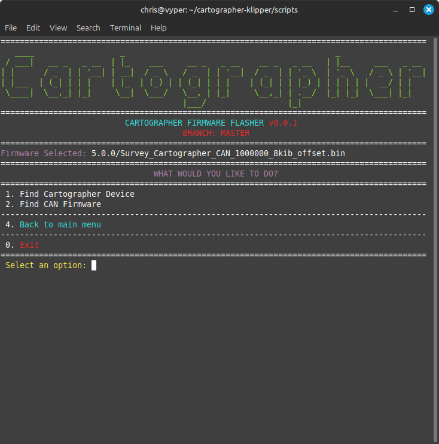
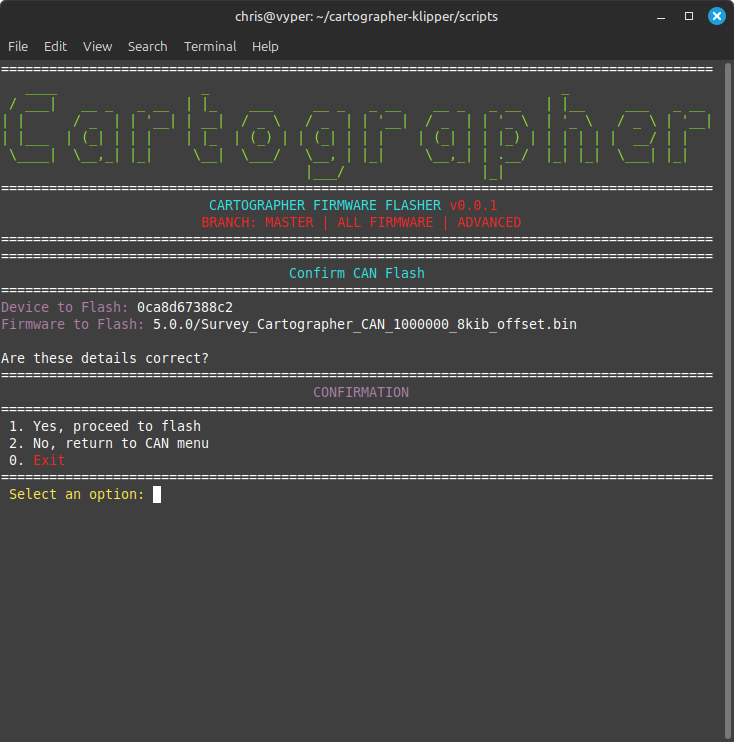
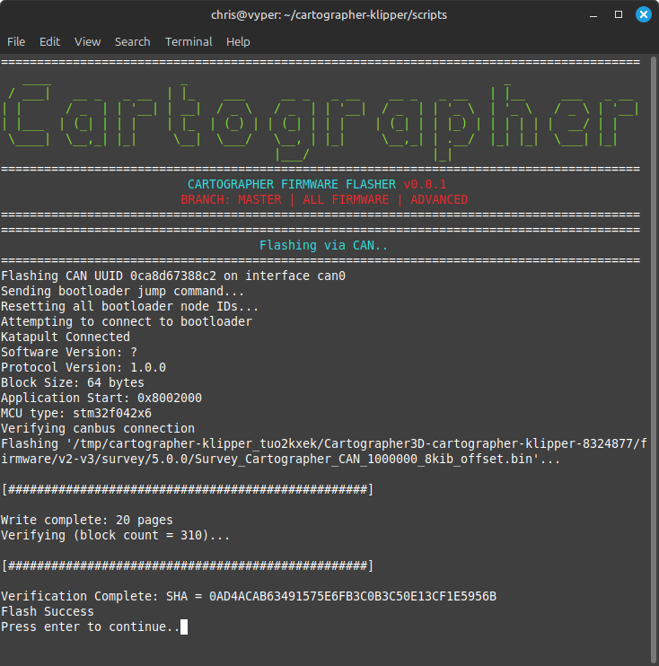

---
layout:
  title:
    visible: true
  description:
    visible: true
  tableOfContents:
    visible: true
  outline:
    visible: true
  pagination:
    visible: false
---

# CANBUS Flash

### CANBUS or USB

* If you ordered a USB flashed cartographer, you use the [USB Katapult Method](usb-flash.md)
* If you ordered a CAN flashed cartographer, you use the [CANBUS Katapult Me](canbus-flash.md)[thod](canbus-flash.md)

### Whats Required?

* Cartographer Probe
* Canbus to JST-PH Cable (For Katapult Canbus Flashing)


Using the scripts below, you may need to use the **Install Prerequisites** option first to make sure everything is configured prior to flashing.


## CANBus Katapult Updating

## Step 1. Plug Cartographer in via CANBUS

## Step 2. Get Your UUID

This method requires prior knowledge of your **CANBUS UUID**.

This should have been supplied to you in your hardware box if purchased (insert date).

If you do not have your UUID. Visit [HERE](../../../classic-installation/klipper-setup.md#finding-the-serial-or-uuid) to get it.

## Step 2. SSH into Device & Run Script

```bash
cd ~/cartographer-klipper/scripts
./firmware.py -f can
```

## Step 3. Select Katapult - Can Menu



## Step 3. Find Your Device

<figure><figcaption></figcaption></figure>

## Step 4. Find Your Device pt2

<figure><figcaption></figcaption></figure>

## Step 5. Find Latest Firmware


Your CANBUS bitrare (if configured on your host device) should be detected and displayed. You should flash your cartographer with MATCHING bitrate firmware.


<figure><figcaption></figcaption></figure>

## Step 6. Flash Firmware

<figure><figcaption></figcaption></figure>

## Step 7. Device Flashing

<figure><figcaption></figcaption></figure>

## Step 8. All Done
