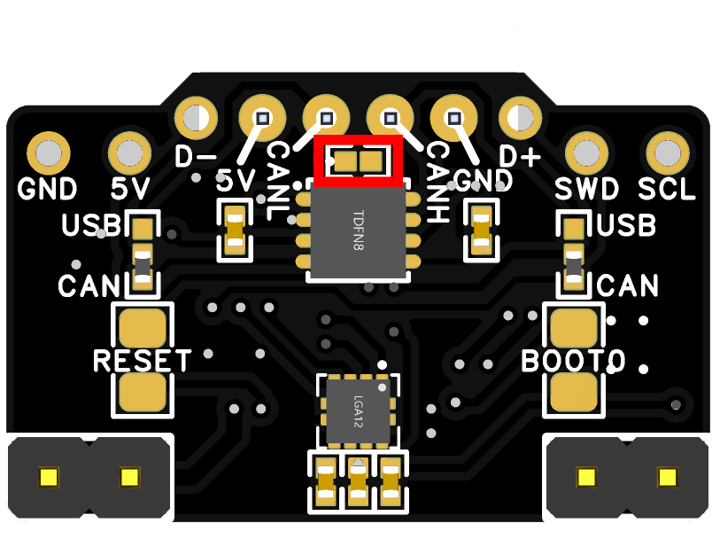
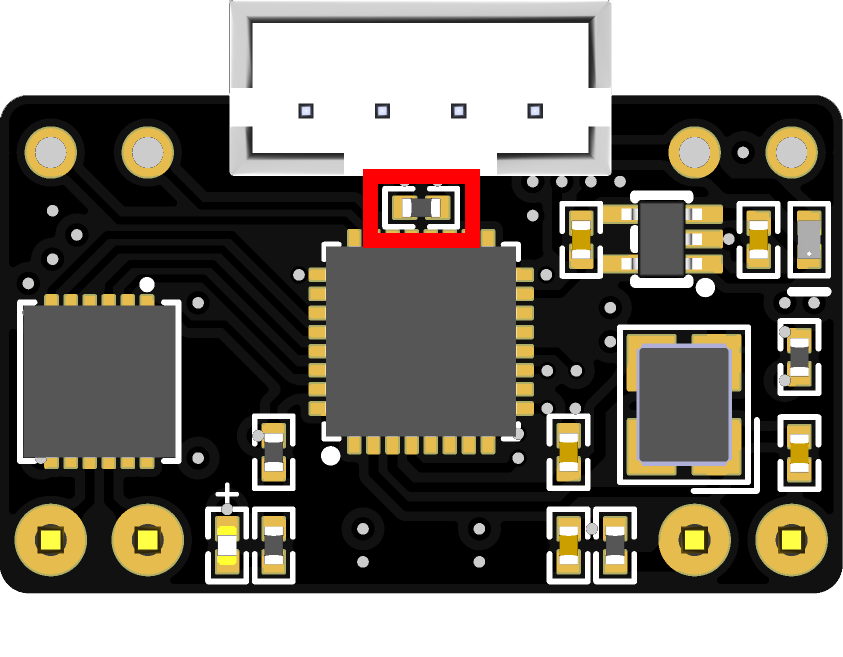

# CAN Termination

### CAN Probe termination status

<table><thead><tr><th width="494">Probe</th><th width="148">Default Status</th></tr></thead><tbody><tr><td>Cartographer V2 CAN (primarily sold pre-2024)</td><td>Disabled</td></tr><tr><td>Cartographer V3 USB/CAN with lis2dw*</td><td>Enabled</td></tr><tr><td>Cartographer V3 USB/CAN with ADXL345</td><td>Disabled</td></tr></tbody></table>


Do **NOT** measure your resistance while the probe is powered on.\
\
On the Cartographer V3 USB/CAN with lis2dw probe, for the 120ohm resistor to be activated  it has to be powered on, and flashed with the CAN firmware.  That means that you will not be able to measure if your can lines are at 60 ohms. \
\
If you measure them (while the probe is powered off) and you get 60ohms, that means you have too many 120ohm terminations in your CAN network.


### Cartographer w/ Input Shaper (v2)

There are many differing opinions on where and how to terminate your CANBUS setup, if you want to fully meet with spec, you are supposed to terminate on the last device in the chain. \
\
When setting up your probe, this is fairly difficult to do, in this case it can purely be treated like a spur, and you can terminate on your toolhead. With this method, we have not seen any detremental performance or issues.&#x20;

IF you want to terminate on your Cartographer, this requires two solder points to be bridged together (see below)&#x20;

<figure><figcaption></figcaption></figure>

### **Cartographer V3 w/ Input Shaper with lis2dw (USB/CAN Hybrid)**

This version of the probe is terminated with a 120ohm resistor by default when in CAN mode. if you want to remove the 120 Ohm resistor, use a soldering iron to remove the resistor that can be seen below.&#x20;

<figure><figcaption></figcaption></figure>

### **Cartographer V3 w/ Input Shaper with ADXL345 (USB/CAN Hybrid)**

With the ADXL version of the probe, we were not able to enable the pre-terminated 120ohm resistor due to the change and implementation of a higher temperature rated multiplexer.&#x20;

Terminating on the probe is not essential, and we have hundreds of users who terminate on their toolhead with no detremental issues.&#x20;


If you enable the 120 Ohm resistor, you will not be able to use the probe in USB mode, this also means to reflash the probe you will be limited to Katapult mode or using a STLink.


If you want to terminate on your Cartographer V3 ADXL, this requires the three solder points to be bridged together (see anotated below).

<figure><figcaption></figcaption></figure>

