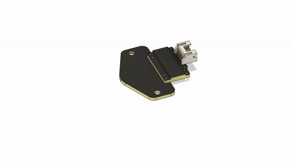
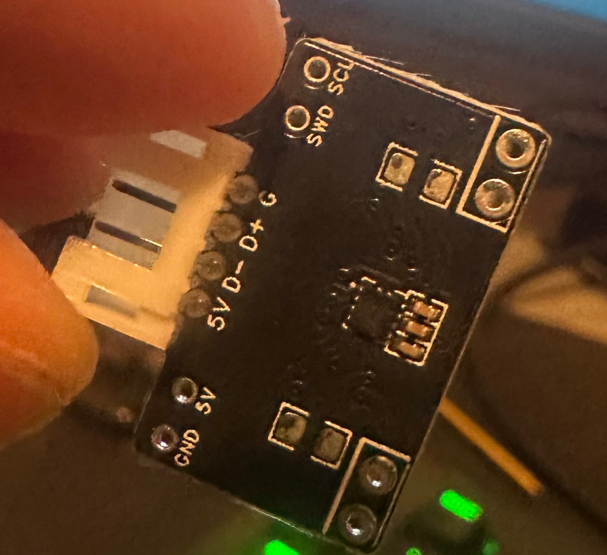

# Creality K1/Max Probe Configuration

##

## In the Creality K1/Max there was very finite space to work with so the Cartographer probe installation is fairly different from a default configuration

Please refer to the following diagram for how the board should be assembled into the mounting assembly.  \

<figure><figcaption>
Cartographer K1/Max installation Illustration
</figcaption></figure>

Note the orientation of the circuit board once placed into the mount it should look as such: \

<figure><figcaption>
PCB Orientation K1/Max
</figcaption></figure>

Since we have flipped the connector for our needs this also requires the JST plug has its pins reversed. You can complete this task with a small flat head or tweezers to relieve the pins from the JST slots\
\
\
Once you have placed the Main PCB the coil board requires some 28g wires ran from the main PCB down the ducting in the mount to the Coil PCB \
\
Please take note of the orientation of the coil PCB when installing (bumps should be facing towards build plate)&#x20;
