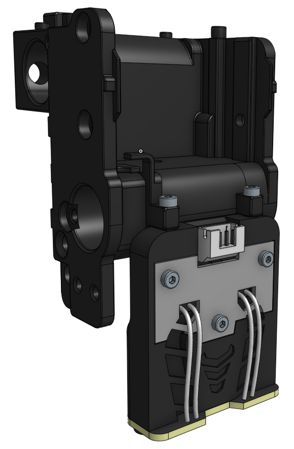
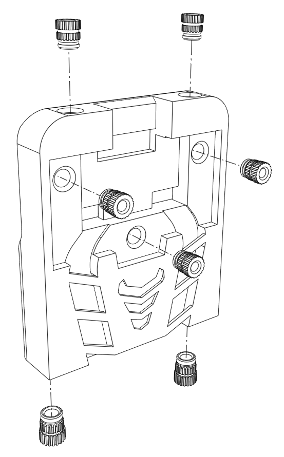
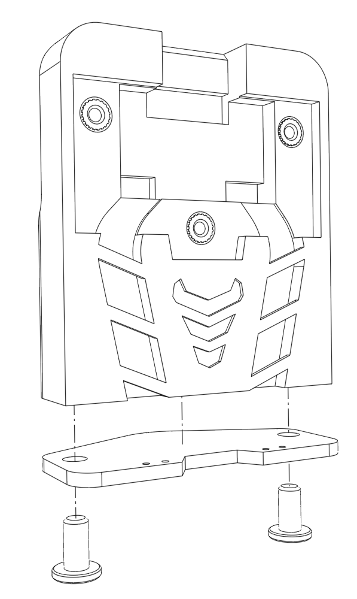
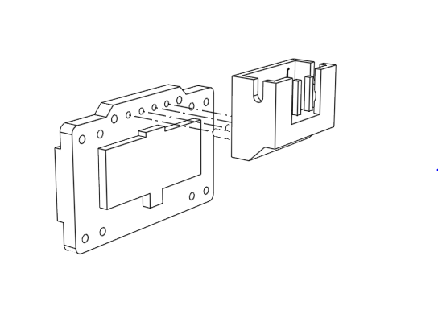
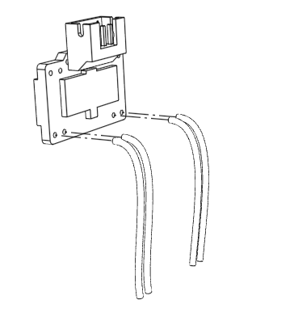
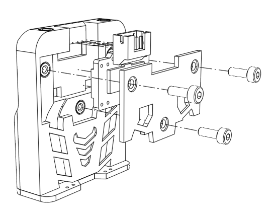
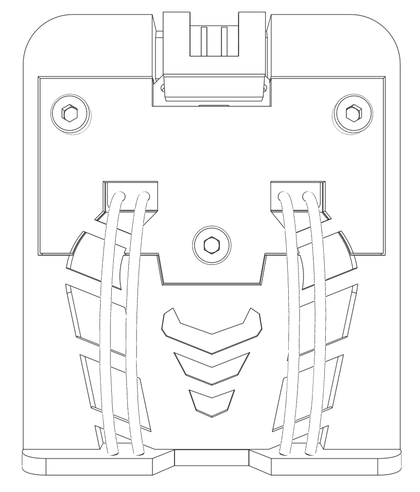
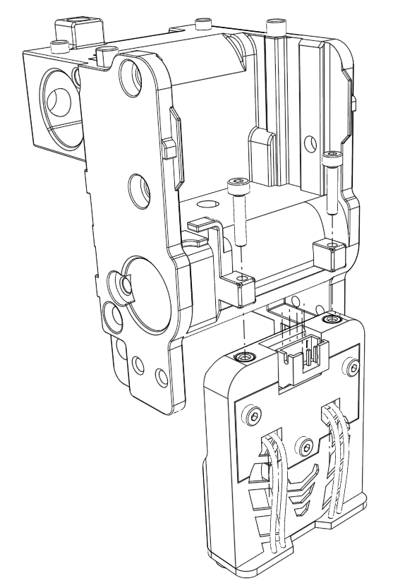
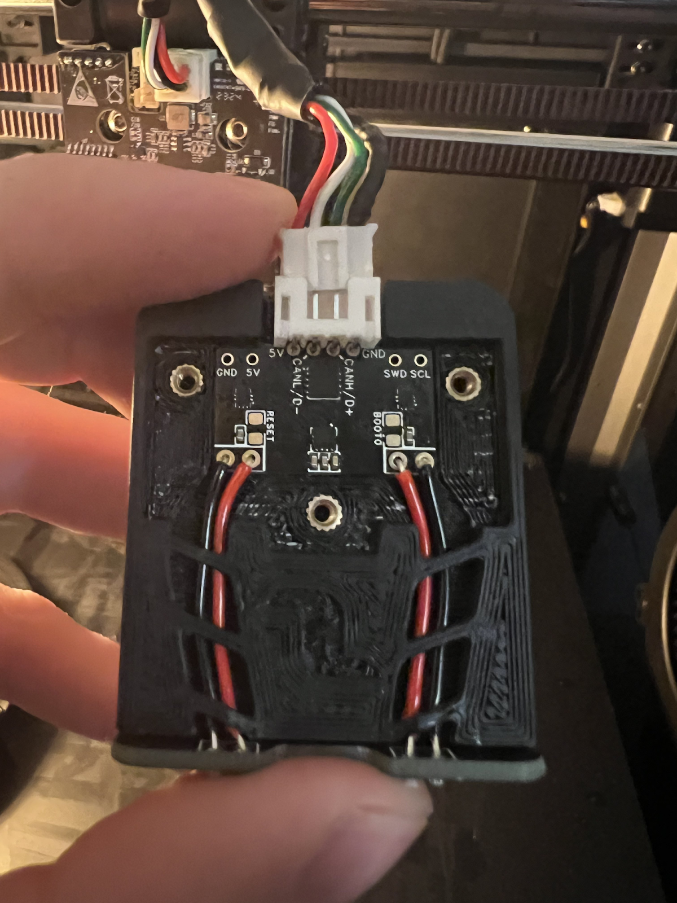

# Creality K1/Max Probe Configuration

## Cartographer for Creality K1 & K1 Max

| <h2></h2>
The modification replaces the hit or miss prtouch bed leveling system of the K1 and K1 Max, introducing a new lightning fast way to mesh your entire bed in seconds at incredible resolution.

<strong>All instructions below are for implementation on the K1 and K1 Max stock toolhead and mainboard.</strong>
 | <h2>BOM</h2><ol><li><strong>1x - Cartographer Flat Pack (USB)</strong></li><li><strong>1x - 1.5m USB A Cable</strong></li><li><strong>5x - M2 Heat inserts (Standard) 3.6mm OD 4.0mm L</strong></li><li><strong>2x - M3 Heat Inserts (Standard) 4.6mm OD 5.7mm L</strong></li><li><strong>2x - M3x8 BHCS</strong></li><li><strong>2x - M2x10 or M2x8 BHCS</strong></li><li><strong>3x - M2x6 BHCS</strong></li><li><strong>1x - ~0.25m total of 26-30 AWG stranded silicone wire</strong></li><li>Tools</li><li>

<ol><li><strong>H2.0 Allen Key (M3 BHCS)</strong></li><li><strong>H1.5 Allen Key (M2 SHCS)</strong></li></ol></li></ol> |
| ------------------------------------------------------------------------------------------------------------------------------------------------------------------------------------------------------------------------------------------------------------------------------------------------------------------------------------------------------------------------------------------------ | ---------------------------------------------------------------------------------------------------------------------------------------------------------------------------------------------------------------------------------------------------------------------------------------------------------------------------------------------------------------------------------------------------------------------------------------------------------------------------------------------------------------------------------------------------------------------------------------------------------------------------------------------- |

|   | <ol><li>Insert M2 &#x26; M3 heated inserts into the housing as shown</li></ol>                                                        |
| ---------------------------------------------------- | ------------------------------------------------------------------------------------------------------------------------------------- |
|      | <ol><li>Secure coil board (nubs down) to the housing using M3x8 BHCS or low profile M3 screw</li></ol>                                |
|        | <ol><li>Solder the connector onto the silkscreened surface of the cartographer mainboard.</li></ol>                                   |
|      | <ol><li>Solder 4 equal length wires to the chipset board</li></ol>                                                                    |
|     | <ol><li>Secure cartographer chipset board into the housing by attaching the cover w/ M2x6 BHCS</li></ol>                              |
|   | <ol><li>Feed wire through the wire channel (not shown), and solder the other end of the wire to the coil board 1:1 as shown</li></ol> |
|  | <ol><li>Secure the Cartographer housing to the toolhead via M2x8 or M2x10 BHCS</li></ol>                                              |

Run a usb from the bottom of the printer, either plugged into the front USB (not recommended) or re-terminated to the 4 pin JST PH into one of the 3 USB mainboard headers, to the Cartographer 4 pin JST PH. The JST connector on the cartographer end need to be repinned as shown below:

<figure><figcaption></figcaption></figure>

Red: 5V | White: D- | Green: D+ | Black: GND
