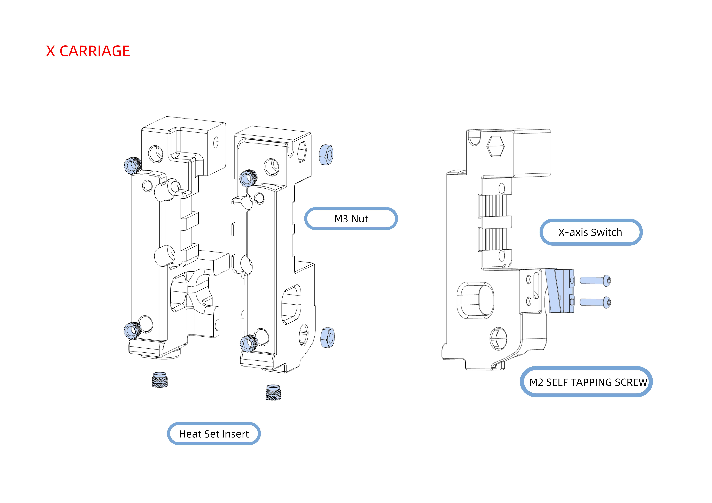
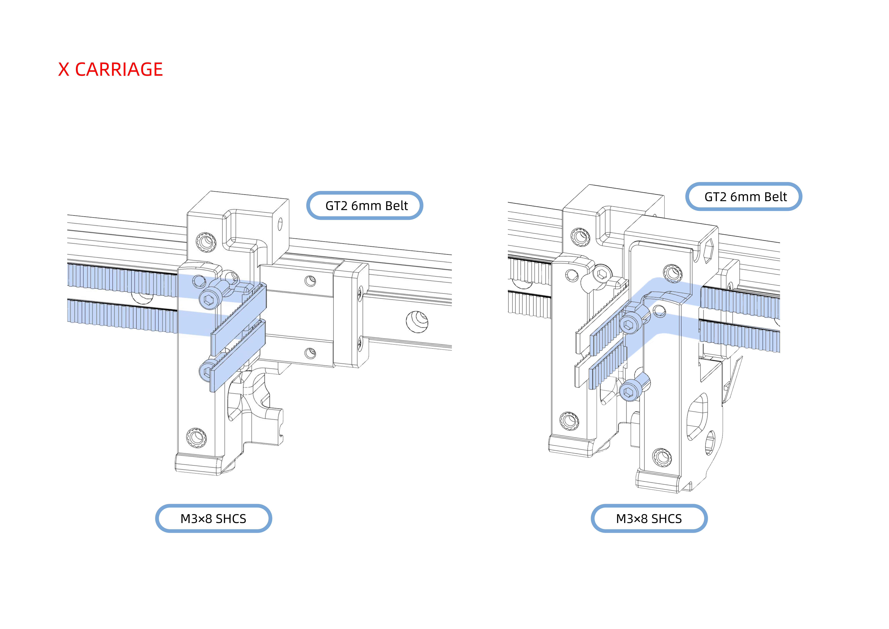
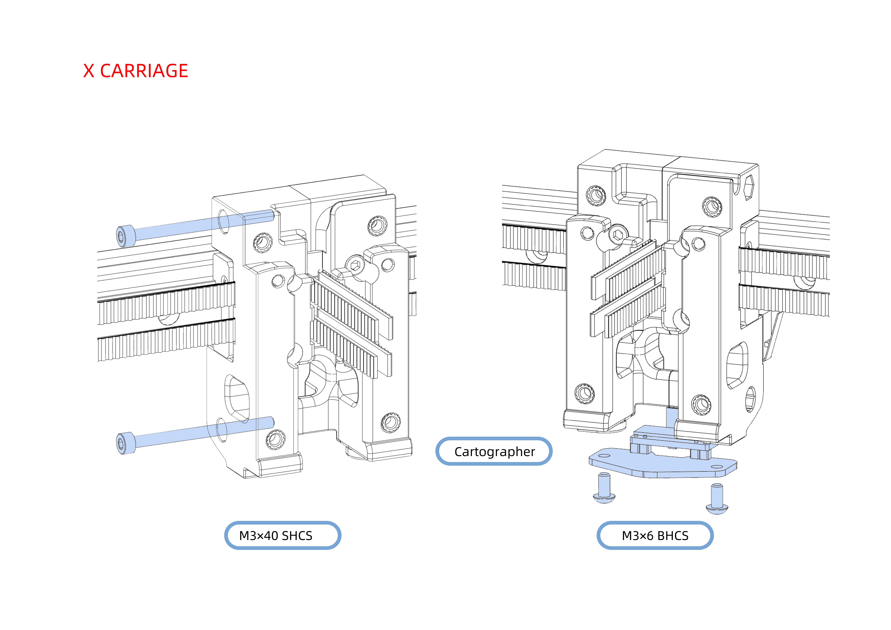

# Stealthburner CW2 Mount


If you are using a Cartographer V4 in Standard format then this mount is compatible. [Standard format CW2 mount](https://www.printables.com/model/708311-voron-24-stealthburner-beacon-revh).



Please note the below mount is NOT compatible with the Cartographer V4 in Standard format, it does however work with the Low Profile format V4.


We are a huge fan of [this Stealthburner CW2 mount,](https://www.teamfdm.com/files/file/686-beacon-cw2-stealthburner-alternative-mounts/) so thought we would make an installation guide.

<figure><figcaption>
Step 1 - Heat Set Inserts &#x26; Endstop
</figcaption></figure>

<figure><figcaption>
Step 2 - Belts
</figcaption></figure>

<figure><figcaption>
Step 3 - Probe Installation
</figcaption></figure>
