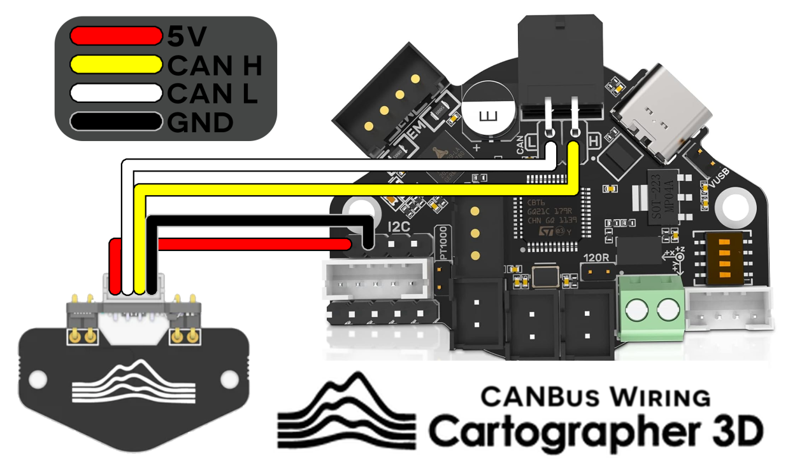
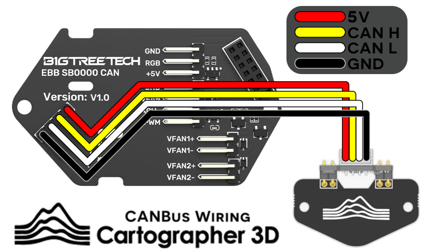

# Wiring Diagrams

Below are some wiring diagrams for some common CAN boards used with Klipper. Currently we only recommend BigTreeTech boards if you are a novice user.&#x20;

We will expand out the wiring diagrams as time goes on and more boards are released.

## BigTreeTech EBB36

### Standard & Low Profile

<figure><figcaption>
EBB36 &#x26; Cartographer CAN Probe (Low Profile / Standard)
</figcaption></figure>


You should apply a twist to your CAN H and CAN L cables every 24mm


### Right Angle

<figure><figcaption>
EBB36 &#x26; Cartographer CAN Probe (Right Angle)
</figcaption></figure>


You should apply a twist to your CAN H and CAN L cables every 24mm


## BigTreeTech EBB42

### Standard & Low Profile

<figure><figcaption>
EBB42 &#x26; Cartographer CAN Probe (Low Profile / Standard)
</figcaption></figure>


You should apply a twist to your CAN H and CAN L cables every 24mm


### Right Angle

<figure><figcaption>
EBB42 &#x26; Cartographer CAN Probe (Right Angle)
</figcaption></figure>


You should apply a twist to your CAN H and CAN L cables every 24mm


## SB2209/SB2240 (via SB0000 breakout board)

### Standard & Low Profile

<figure><figcaption>
SB0000 &#x26; Cartographer CAN Probe (Standard / Low Profile)
</figcaption></figure>


You should apply a twist to your CAN H and CAN L cables every 24mm


### Right Angle

<figure><figcaption>
SB0000 &#x26; Cartographer CAN Probe (Right Angle)
</figcaption></figure>


You should apply a twist to your CAN H and CAN L cables every 24mm

