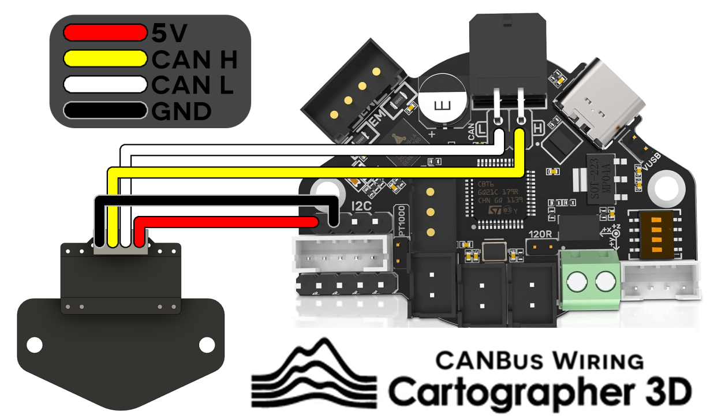
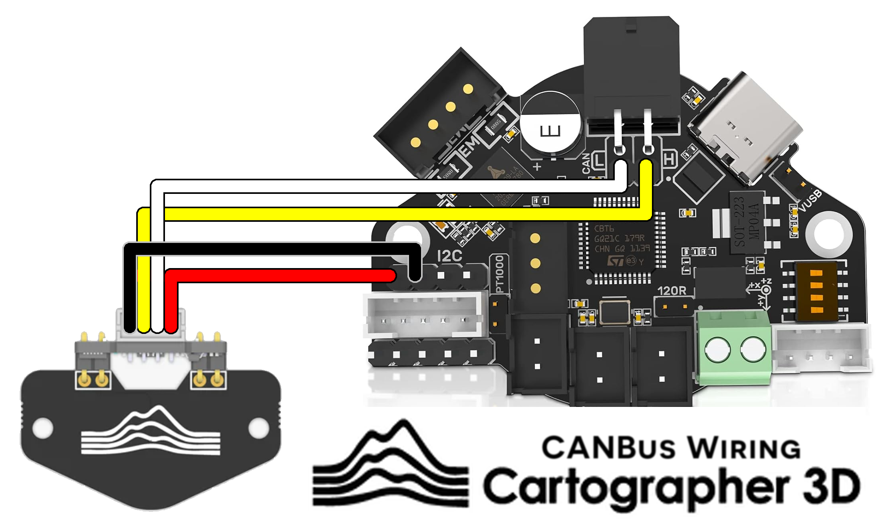
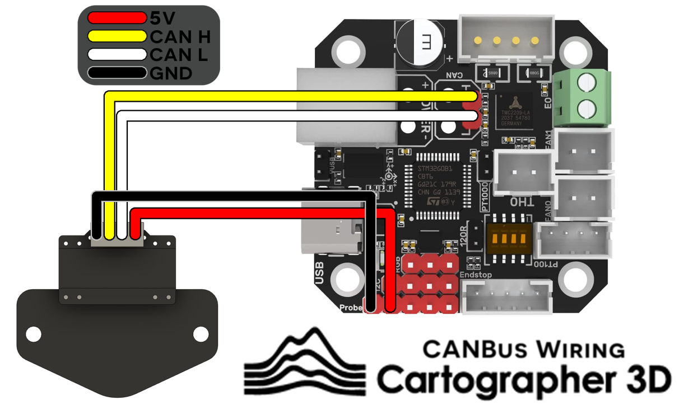
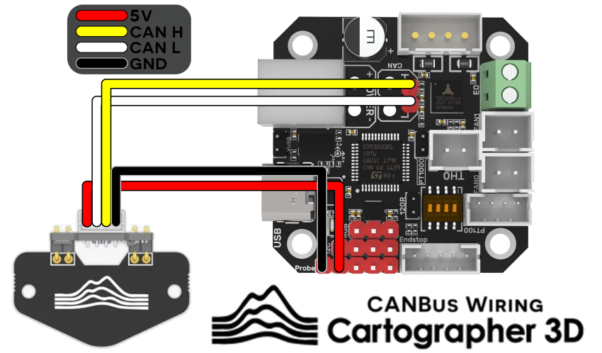
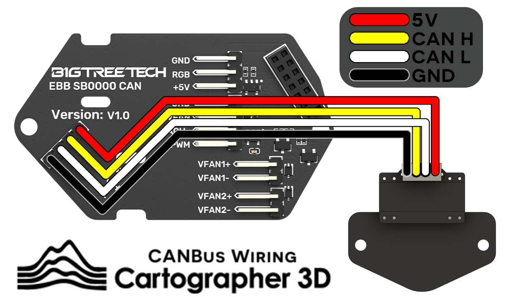
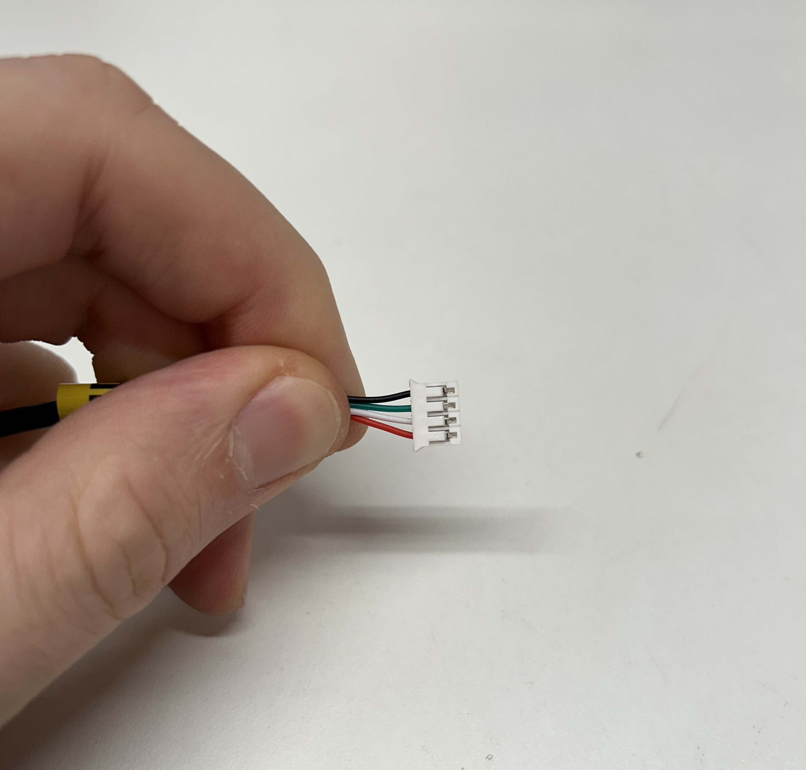
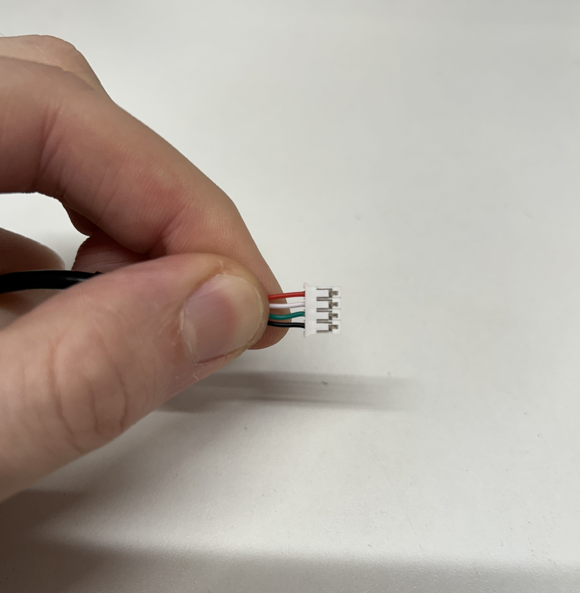

# Wiring Diagrams

***


## Cartographer Probes and AFC Lite MMU boards

We observed that some AFC-Lite Boards (Box Turtle controller) can for unknown reason damage your Cartographer. Therefor we dont recommend running both on the same CAN network as there is a chance of frying your Cartographer. \
\
**Running either over USB is fine.** \
\
Its possible that your AFC-Lite is not affected and that there are other environmental variables at play.


Below are some wiring diagrams for some common CAN boards used with Klipper. Currently we only recommend BigTreeTech boards if you are a novice user.&#x20;

We will expand out the wiring diagrams as time goes on and more boards are released.


You may not be able to flash your EBB36 or EBB42 over CanBus while Cartographer is connected, simply unplug the CAN H and CAN L pin, flash it and then re-connect after.&#x20;


## BigTreeTech EBB36

### Standard & Low Profile

<figure><figcaption>
EBB36 &#x26; Cartographer CAN Probe (Low Profile / Standard)
</figcaption></figure>


You should apply a twist to your CAN H and CAN L cables every 24mm


### Right Angle

<figure><figcaption>
EBB36 &#x26; Cartographer CAN Probe (Right Angle)
</figcaption></figure>


You should apply a twist to your CAN H and CAN L cables every 24mm


## BigTreeTech EBB42

### Standard & Low Profile

<figure><figcaption>
EBB42 &#x26; Cartographer CAN Probe (Low Profile / Standard)
</figcaption></figure>


You should apply a twist to your CAN H and CAN L cables every 24mm


### Right Angle

<figure><figcaption>
EBB42 &#x26; Cartographer CAN Probe (Right Angle)
</figcaption></figure>


You should apply a twist to your CAN H and CAN L cables every 24mm


## SB2209/SB2240 (via SB0000 breakout board)

### Standard & Low Profile

<figure><figcaption>
SB0000 &#x26; Cartographer CAN Probe (Standard / Low Profile)
</figcaption></figure>


You should apply a twist to your CAN H and CAN L cables every 24mm


### Right Angle

<figure><figcaption>
SB0000 &#x26; Cartographer CAN Probe (Right Angle)
</figcaption></figure>


You should apply a twist to your CAN H and CAN L cables every 24mm


## USB Wiring

#### Standard Format Cartographer USB Wiring

<figure><figcaption></figcaption></figure>

Wiring for the USB connector is in order

* Ground
* DATA +
* DATA -
* 5V

#### Right Angle Format Cartographer USB Wiring

<figure><figcaption></figcaption></figure>

Wiring for the USB connector is in order

* 5V
* DATA -
* DATA +
* Ground
