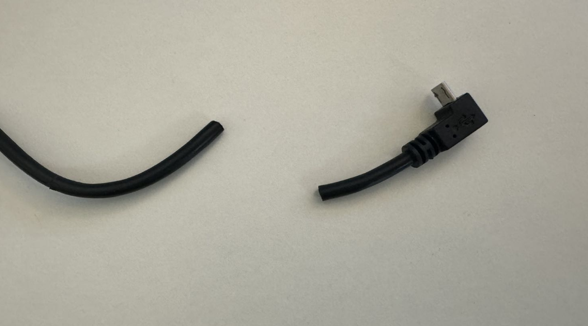

# 😕 Troubleshooting

This list is NOT exhaustive, if you need support don't be a stranger and please come and talk to us on Discord, we are more than happy to help. \
\
If you do think that something is missing, please let us know and I will add it as soon as I can.&#x20;

### Option 'pin' in section 'probe' must be specified

<figure><figcaption></figcaption></figure>

This can occur either after a Klipper update when the sym link occasionally gets broken, or if you have not installed the Klipper component during the install, either way the fix is the same, just re-run the installer below.

```
cd ~
git clone https://github.com/Cartographer3D/cartographer-klipper.git
chmod +x cartographer-klipper/install.sh
./cartographer-klipper/install.sh
```

### Unknown pin chip name 'cartographer'


<figure><figcaption><p>Unknown pin chip name 'cartographer'</p></figcaption></figure>

The following two issues are usually why you recieve the above error.

1. You are referencing cartographer before you have declared it in your config file. It is advisable to add the cartographer section just below where you declare your MCU's.
2. You have referenced cartographer with a capitilisation `[Cartographer]` vs `[cartographer]` or `cs_pin: Cartographer:PA3` vs `cs_pin: cartographer:PA3`

### Unknown pin chip name 'probe'

<figure><figcaption></figcaption></figure>

This error usually  happens when you have your `[cartographer]` section below your `[stepper_z]` section, move the `[cartographer]` section near your MCU's.&#x20;

### mcu 'cartographer': Unknown command: endstop\_home

In `[stepper_z]` you have set  `endstop_pin: cartographer:z_virtual_endstop` this should be `endstop_pin: probe:z_virtual_endstop`

### Error importing numpy error

<figure><figcaption><p>"Error importing numpy: you should not try to import numpy from" error</p></figcaption></figure>

<figure><figcaption><p>The error in a slightly different view.</p></figcaption></figure>

This error usually occours when you have installed Cartographer as root rather than as a normal user (not always, but that is the only way I have been able to replicate it.).

In order to fix this, please update Klipper to the latest version either via your WebUI, or via KIAUH, once updated please access your Pi (or similar) via ssh

Run the the following command:

```bash
sudo apt install libopenblas-base
```

if the above doesn't work, please try the following

```bash
sudo apt install libopenblas-dev
```

### Endstop showing Triggered


<figure><figcaption><p>Endstop Z showing constantly triggered</p></figcaption></figure>

Please ensure that you have calibrated your probe&#x20;

### Option mesh\_main\_direction is not a valid section in cartographer

<figure><figcaption></figcaption></figure>

You do not have a valid \[bed\_mesh] section in your printer.cfg, please check out [this site](https://www.klipper3d.org/Bed\_Mesh.html) for how to add one.

### Unable to parse option mesh\_runs in section cartographer

<figure><figcaption></figcaption></figure>

You do not have a valid \[bed\_mesh] section in your printer.cfg, please check out [this site](https://www.klipper3d.org/Bed\_Mesh.html) for how to add one.

### Unable to find your Cartographer USB probe via `ls /dev/serial/by-id/`

So there are a few reasons you might not be able to find your Cartographer probe.

1.  A bug has been introduced in Debian Bullseye (which includes MainsailOS), which prevents the symlinks in /dev/serial/by-id/ from being created. If your printer can't connect to the MCU anymore after a system update, you can check if it is caused by that bug by checking the installed version of udev with `apt show udev`

    \
    If your version is `247.3-7+deb11u2` or `247.3-7+rpi1+deb11u2` you have the broken package installed and should use one of the fixes below. Take special care about the last number ("u2").\
    \
    As of May 20 2023, this bug has spread to PiOS based systems as well.\
    \
    **To Fix -** Replace the corrupted udev file with one from upstream systemd:&#x20;

```
# backup the existing rules file (just in case)

sudo cp /usr/lib/udev/rules.d/60-serial.rules /usr/lib/udev/rules.d/60-serial.old

# download the rule from the systemd main repo.
sudo wget -O /usr/lib/udev/rules.d/60-serial.rules https://raw.githubusercontent.com/systemd/systemd/main/rules.d/60-serial.rules

# reboot
sudo reboot
```

2. If you have a v3 probe, it might be flashed for CAN Mode, please re-flash it for USB Operation, this includes the Katapult bootloader, as this is used to change the operation of the probe itself. \
   \
   For more information on how to do that, [click here ](firmware-update/)
3. Check your USB Cable - If you have bought a flat pack, and your probe is a assembled for RIGHT ANGLE operation, you might have to re-assemble re-pin your USB cable in reverse.&#x20;

### Klipper environement running on Python 2

You will need to update your Klipper env from Python 2 to Python 3.  the following guide is taken from [https://klipper.discourse.group/t/process-for-migrating-to-python3/5292/3](https://klipper.discourse.group/t/process-for-migrating-to-python3/5292/3) \
\
There is another outstanding guide by EricZimmerman that I would highly recommend checking out \
[ https://github.com/EricZimmerman/VoronTools/blob/main/OSUpgrade.md](https://github.com/EricZimmerman/VoronTools/blob/main/OSUpgrade.md)\



Note - a minimum version of Pyhon 3.9 is required. &#x20;


```bash
sudo service klipper stop

# remove current klippy-env environment
cd ~
rm -rf klippy-env

# create new venv
virtualenv -p python3 klippy-env

#install new Klipper venv
cd ~/klippy-env
bin/pip install -r ../klipper/scripts/klippy-requirements.txt
```

Restart your pritner, and you should now have a wonderful Klipper environement running in Python3.

### Klipper is showing my install as dirty?

<figure><figcaption></figcaption></figure>

Klipper will show any build as klipper as "dirty" if there are any untracked Python files within the folders, this is the same with all other python based plugins such as ShakenTune, LEDEffects and so on. \
\
Unfortuantly, there is no way around this at the moment. \
\
[https://github.com/Klipper3d/klipper/actions/runs/4840565448](https://github.com/Klipper3d/klipper/actions/runs/4840565448)

