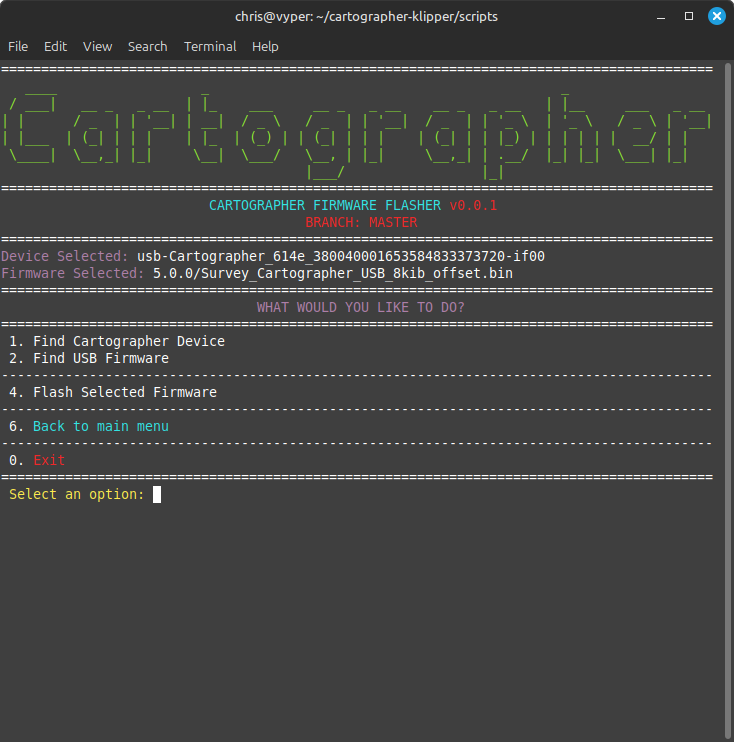
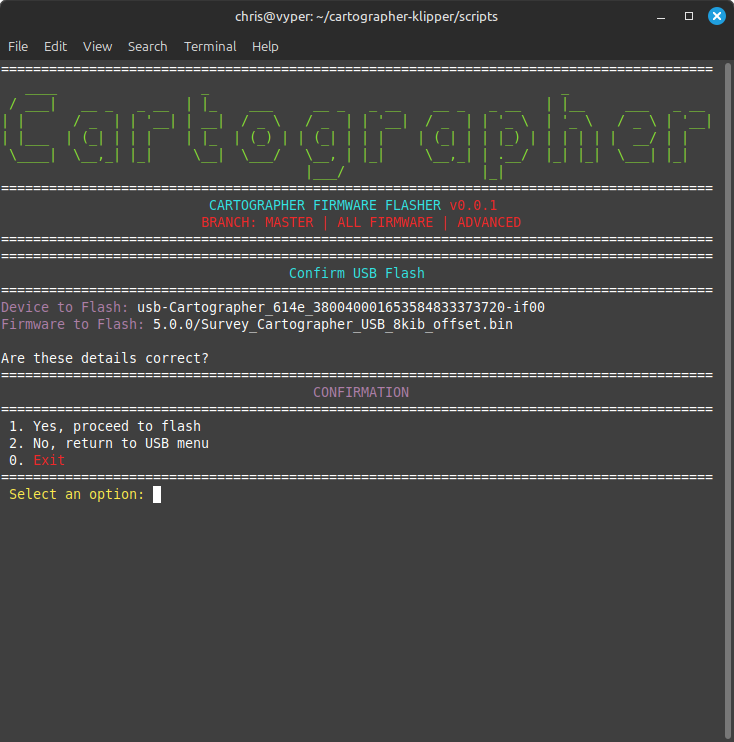
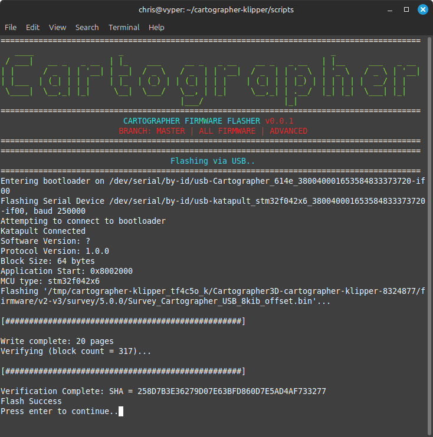

# USB Flash

### CANBUS or USB

* If you ordered a USB flashed cartographer, you use the [USB Katapult Method](usb-flash.md)
* If you ordered a CAN flashed cartographer, you use the [CANBUS Katapult Me](canbus-flash.md)[thod](canbus-flash.md)

### Whats Required?

* Cartographer Probe
*   USB-A to JST-PH Cable

    <figure><figcaption></figcaption></figure>


Using the scripts below, you may need to use the **Install Prerequisites** option first to make sure everything is configured prior to flashing.


## USB Katapult Updating

## Step 1. Plug Cartographer in via USB

## Step 2. SSH into Device & Run Script

```bash
cd ~
if [ -d ~/cartographer_firmware/ ]; then
    echo "Directory Exists - Starting Firmware Script"
    cd ~/cartographer_firmware/
    git pull
else
    git clone https://github.com/Cartographer3D/cartographer_firmware.git
fi
~/cartographer_firmware/scripts/firmware.py
```

## Step 3. Select Katapult - USB Menu

<figure><figcaption></figcaption></figure>

## Step 4. Find Your Device

<figure><figcaption></figcaption></figure>

## Step 5. Select Your Device

<figure><figcaption></figcaption></figure>

## Step 6. Find Latest Firmware

<figure><figcaption></figcaption></figure>

## Step 7. Flash Firmware

<figure><figcaption></figcaption></figure>

## Step 8. Device Flashing

<figure><figcaption></figcaption></figure>

## Step 9. All Done
